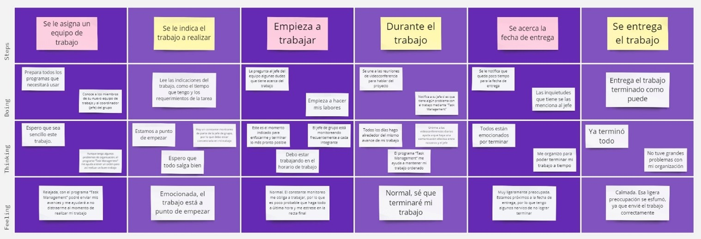
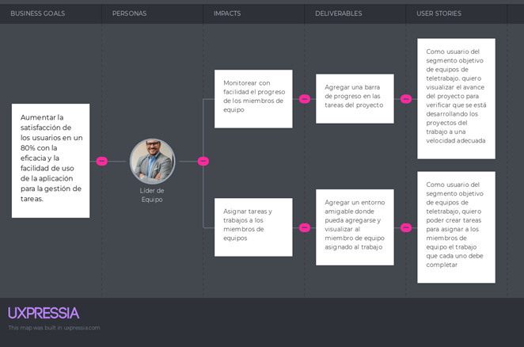
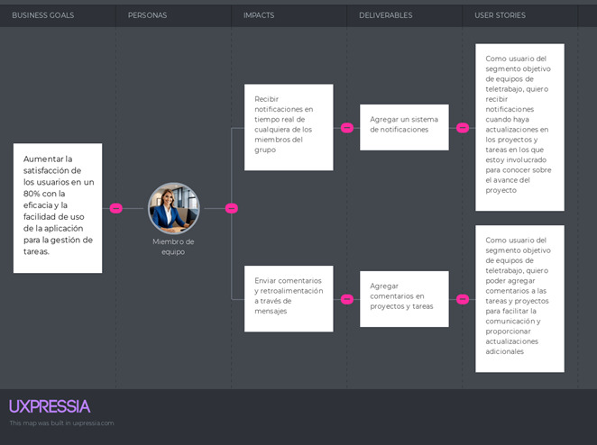
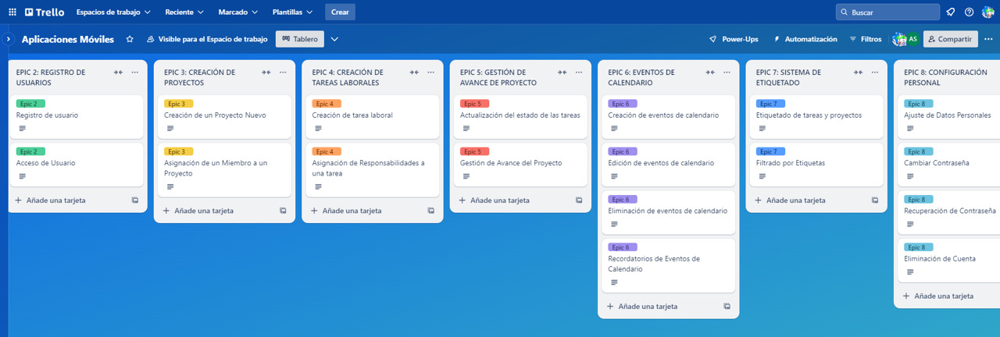

    <h1> Universidad Peruana de Ciencias Aplicadas </h1>
    <h3>Carrera: Ingenieria de Software</h3>
    <h3>Ciclo: 2024-02</h3>
    <h3>Aplicaciones para Dispositivos Móviles</h3>
    <h3>Sección: SW61</h3>
    <h3>Profesor: Mayta Guillermo, Jorge Luis</h3>
    <h3>Informe de Trabajo Final</h3>
    <h3>Startup: Task Management</h3>
    <h3>Producto: Workflow</h3>
    <h4>Integrantes:</h4>
    <table>
        <tr>
            <th> Nombre </th>
            <th> Código </th>
        </tr>
        <tr>
            <td> Cisneros Tafur, Diego Rafael </td>
            <td> u20221a715 </td>
        </tr>
        <tr>
            <td> Mendoza Pimentel, Piero </td>
            <td> u201923446 </td>
        </tr>
        <tr>
            <td> Neyra Santa Cruz, Marcelo Sebastian </td>
            <td> u202217241 </td>
        </tr>
        <tr>
            <td> Periche Quiroga, Piero Fernando </td>
            <td> u202210192 </td>
        </tr>
        <tr>
            <td> Silva Morales, Renzo Cesar </td>
            <td> u20221c362 </td>
        </tr>
    </table>
    <h5> 2024-02 </h5>

## Registro de Versiones de Informe
<table>
    <tr>
        <th>Versión</th>
        <th>Fecha</th>
        <th>Autor</th>
        <th>Descripción</th>
    <tr>
    <tr>
        <th rowspan="6">#1 TB1</th>
        <td>22/08/2024</td>
        <td>Cisneros Tafur, Diego Rafael</td>
        <td>
            
TBD
 
        </td>
    </tr>
    <tr>
        <td>22/08/2024</td>
        <td>Mendoza Pimentel, Piero</td>
        <td>
            
TBD
 
        </td>
    </tr>
    <tr>
        <td>22/08/2024</td>
        <td>Neyra Santa Cruz, Marcelo Sebastian</td>
        <td>
            
TBD
 
        </td>
    </tr>
    <tr>
        <td>22/08/2024</td>
        <td>Periche Quiroga, Piero Fernando</td>
        <td>
            
TBD
 
        </td>
    </tr>
    <tr>
        <td>22/08/2024</td>
        <td>Silva Morales, Renzo Cesar</td>
        <td>
            
TBD
 
        </td>
    </tr>
</table>

## Contenido

### [1. Capítulo 1: Presentación](#cap1)
#### [1.1. Startup Profile](#start-up)
    1.1.1 Descripción de la Startup
    1.1.2 Perfiles de los integrantes
#### [1.2. Solution Profile](#solution-profile)
    1.2.1. Antecedentes y problemática
    1.2.2. Lean UX Process
        1.2.2.1. Lean UX Problem Statements
        1.2.2.2. Lean UX Assumptions
        1.2.2.3. Lean UX Hypothesis Statements
        1.2.2.4. Lean UX Canvas
#### [1.3 Segmentos objetivo](#segmentos-objetivos)

---

### [2. Capítulo 2: Needfinding](#cap2)
#### [2.1. Competidores](#competidores)
    2.1.1. Análisis competitivo
    2.1.2. Estrategias y tácticas frente a competidores
#### [2.2. Entrevistas](#entrevistas-need)
    2.2.1. Diseño de entrevistas
    2.2.2. Registro de entrevistas
    2.2.3. Análisis de entrevistas
#### [2.3. Needfinding](#needfinding)
    2.3.1. User Personas
    2.3.2. User Task Matrix
    2.3.3. User Journey Mapping
    2.3.4. Empathy Mapping
    2.3.5. As-is Scenario Mapping
#### [2.4. Requirements Specification](#requirements-specification)
    2.4.1. To-Be Scenario Mapping
    2.4.2. User Stories
    2.4.3. Impact Mapping
    2.4.4. Product Backlog
---

### [3. Capítulo 3: Arquitectura](#cap3)
#### [3.1. Product Design](#product-design)
    3.1.1. Style Guidelines
        3.1.1.1. General Style Guidelines
    3.1.2 Information Architecture
        3.1.2.1. Organization Systems
        3.1.2.2. Labeling Systems
        3.1.2.3. SEO Tags and Meta Tags
        3.1.2.4. Searching Systems
        3.1.2.5. Navigation Systems
    3.1.3 Landing Page UI Design
        3.1.3.1. Landing Page Wireframe
        3.1.3.2. Landing Page Mock-up
    3.1.4 Mobile Applications UX/UI Design
        3.1.4.1. Mobile Applications Wireframes
        3.1.4.2. Mobile Applications Wireflow Diagrams
        3.1.4.3. Mobile Applications Mock-ups
        3.1.4.4. Mobile Applications User Flow Diagrams
        3.1.4.5. Mobile Applications Prototyping
#### [3.2. Architecture Overview](#architecture-overview)
    3.2.1. Domain-Driven Software Architecture
        3.2.1.1. Software Architecture Context Level Diagram
        3.2.1.2. Software Architecture Container Level Diagram
        3.2.1.3. Software Architecture Components Diagram
    3.2.2. Software Object-Oriented Design
        3.2.2.1. Class Diagrams
        3.2.2.2. Class Dictionary
        3.2.2.3. Database Design
        3.2.2.4. Database Diagram
---

### [4. Capítulo 4: Backend Product Implementation & Validation](#cap4)
#### [4.1. Software Configuration Management](#4-software-configuration-management)
    4.1.1. Software Development Environment Configuration
    4.1.2. Source Code Management
    4.1.3. Source Code Style Guide & Conventions
    4.1.4. Software Deployment Configuration
#### [4.2. Software Development & Implementation](#4-software-development--implementation)
##### [4.2.1. Sprint 1](#sprint-1)
    4.2.1.1. Sprint Planning 1
    4.2.1.2. Sprint Backlog 1
    4.2.1.3. Development Evidence for Sprint Review
    4.2.1.4. Testing Suite Evidence for Sprint Review
    4.2.1.5. Execution Evidence for Sprint Review
    4.2.1.6. Services Documentation Evidence for Sprint Review
    4.2.1.7. Software Deployment Evidence for Sprint Review
    4.2.1.8. Team Collaboration Insights during Sprint
---

### [5. Capítulo 5: Product Implementation & Validation](#cap5)
#### [5.1. Software Configuration Management](#5-software-configuration-management)
    5.1.1. Software Development Environment Configuration
    5.1.2. Source Code Management
    5.1.3. Source Code Style Guide & Conventions
    5.1.4. Software Deployment Configuration
#### [5.2. Landing Page & Mobile Application Implementation](landing-page--mobile-application-implementation)
    5.2.1. Sprint n
        5.2.1.1. Sprint Planning n
        5.2.1.2. Sprint Backlog n
        5.2.1.3. Development Evidence for Sprint Review
        5.2.1.4. Testing Suite Evidence for Sprint Review
        5.2.1.5. Execution Evidence for Sprint Review
        5.2.1.6. Services Documentation Evidence for Sprint Review
        5.2.1.7. Software Deployment Evidence for Sprint Review
        5.2.1.8. Team Collaboration Insights during Sprint
#### [5.3. Validation Interviews](#validation-interviews)
    5.3.1. Diseño de Entrevistas
    5.3.2. Registro de Entrevistas
    5.3.3. Evaluaciones según heurísticas
#### [5.4. Video About-the-Product](#video-about-the-product)
---
### [6. Conclusiones](#conclusiones)
### [7. Glosario](#glosario)
### [8. Bibliografía](#bibliografia)
### [9. Anexos](#anexos)

## Student Outcome
<table>
    <tr>
        <th>Criterio Específico</th>
        <th>Acciones realizadas</th>
        <th>Conclusiones</th>
    </tr>
    <tr>
        <td>
            
Actualiza conceptos y conocimientos necesarios para su desarrollo profesional y en especial para su proyecto en soluciones de software

        </td>
        <td>
            <h5>Cisneros Tafur, Diego Rafael</h5>
            <h5>TB1</h5>
            
Escribe aquí lo que hiciste

            <h5>Mendoza Pimentel, Piero</h5>
            <h5>TB1</h5>
            
Escribe aquí lo que hiciste

            <h5>Neyra Santa Cruz, Marcelo Sebastian</h5>
            <h5>TB1</h5>
            
Escribe aquí lo que hiciste

            <h5>Periche Quiroga, Piero Fernando</h5>
            <h5>TB1</h5>
            
Escribe aquí lo que hiciste

            <h5>Silva Morales, Renzo Cesar</h5>
            <h5>TB1</h5>
            
Escribe aquí lo que hiciste

        </td>
        <td>
            
Aqui van las conclusiones

        </td>
    </tr>
    <tr>
        <td>
            
Reconoce la necesidad del aprendizaje permanente para el desempeño profesional y el desarrollo de proyectos en soluciones de software

        </td>
        <td>
            <h5>Cisneros Tafur, Diego Rafael</h5>
            <h5>TB1</h5>
            
Escribe aquí lo que hiciste

            <h5>Mendoza Pimentel, Piero</h5>
            <h5>TB1</h5>
            
Escribe aquí lo que hiciste

            <h5>Neyra Santa Cruz, Marcelo Sebastian</h5>
            <h5>TB1</h5>
            
Escribe aquí lo que hiciste

            <h5>Periche Quiroga, Piero Fernando</h5>
            <h5>TB1</h5>
            
Escribe aquí lo que hiciste

            <h5>Silva Morales, Renzo Cesar</h5>
            <h5>TB1</h5>
            
Escribe aquí lo que hiciste

        </td>
        <td>
            
Aqui van las conclusiones

        </td>
    </tr>
</table>

## Objectivos SMART

<table>
    <tr>
        <th colspan="4"></th>
        <th colspan="5">Metodología SMART</th>
    </tr>
    <tr>
        <th colspan="4"></th>
        <th>Specific</th>
        <th>Measurable</th>
        <th>Ambitious</th>
        <th>Relevant</th>
        <th>Time-bound</th>
    </tr>
    <tr>
        <th>Nombre del estudiante</th>
        <th>Descripción del objetivo</th>
        <th>Fecha de inicio</th>
        <th>Fecha de cumplimiento esperada</th>
        <td>
            

                <strong>¿Qué se va a lograr?</strong>  
                El objetivo indica con especificidad, cuál es el proceso, servicio o producto en cuestión, para qué área es relevante, u otro detalle clave que brinde contexto
            

        </td>
        <td>
            

                <strong>¿Tiene KPI o métrica clara?</strong>  
                El enunciado tiene una meta con indicador (KPI) o métrica clara, que determinará si el objetivo se cumplió. Idealmente, describe el impacto (lo que vamos a lograr) más que el entregable (lo que vamos a hacer)
            

        </td>
        <td>
            

            ¿Está alineado a la estratégia?
                <strong>¿Es retador y va más allá de sus funciones?</strong>  
                El objetivo inspira y reta a pensar acciones para dar el salto que se requiere para el logro, no se lograría sin una estrategia y un foco potentes
            

        </td>
        <td>
            

                <strong>¿Está alineado a la estratégia?</strong>  
                Existe una explicación clara respecto a cómo el objetivo impacta sobre los objetivos estratégicos de la Institución o Laureate Perú. Brinda una noción del alcance del objetivo
            

        </td>
        <td>
            

                <strong>¿Cuándo se cumplirá?</strong>  
                En caso que la expectativa de fecha de cumplimiento sea previa al cierre de año, el enunciado contiene de forma explícita la fecha límite para alcanzar el objetivo
            

        </td>
    </tr>
    <tr>
        <td>Cisneros Tafur, Diego Rafael</td>
        <td>Descripción de Objetivo</td>
        <td>Inicio</td>
        <td>Fin</td>
        <td>S</td>
        <td>M</td>
        <td>A</td>
        <td>R</td>
        <td>T</td>
    </tr>
    <tr>
        <td>Mendoza Pimentel, Piero</td>
        <td>Descripción de Objetivo</td>
        <td>Inicio</td>
        <td>Fin</td>
        <td>S</td>
        <td>M</td>
        <td>A</td>
        <td>R</td>
        <td>T</td>
    </tr>
    <tr>
        <td>Neyra Santa Cruz, Marcelo Sebastian</td>
        <td>Descripción de Objetivo</td>
        <td>Inicio</td>
        <td>Fin</td>
        <td>S</td>
        <td>M</td>
        <td>A</td>
        <td>R</td>
        <td>T</td>
    </tr>
    <tr>
        <td>Periche Quiroga, Piero Fernando</td>
        <td>Descripción de Objetivo</td>
        <td>Inicio</td>
        <td>Fin</td>
        <td>S</td>
        <td>M</td>
        <td>A</td>
        <td>R</td>
        <td>T</td>
    </tr>
    <tr>
        <td>Silva Morales, Renzo Cesar</td>
        <td>Descripción de Objetivo</td>
        <td>Inicio</td>
        <td>Fin</td>
        <td>S</td>
        <td>M</td>
        <td>A</td>
        <td>R</td>
        <td>T</td>
    </tr>
</table>

##  Capítulo 1: Presentación

Esta es la sección de presentación. Se mostrarán todos los puntos relacionados con la descripción básica de la empresa, como los integrantes y objetivos.

###  1.1 Startup Profile

El grupo Task Management es una startup liderada por estudiantes de la Universidad Peruana de Ciencias Aplicadas (UPC), pertenecientes a la carrera de Ingeniería de Software. Esta incipiente empresa se especializa en el desarrollo de software y soluciones tecnológicas dirigidas a los equipos de trabajo. El objetivo de la empresa es ayudar a estos individuos a alcanzar una organización adecuada de sus tareas y proyectos y, sobre todo, cumplir a sus metas. Asimismo, se sigue un modelo de aprendizaje mutuo con los clientes, para, de esa manera, poder mejorar progresivamente la calidad de atención al cliente y las herramientas que ofrece la empresa. Para ello, se ha diseñado una aplicación mobile llamada <i>Workflow</i>, dedicada en su totalidad a lograr lo anteriormente planteado.

#### Misión

    Contribuir en la gestión y organización de proyectos y tareas de los equipos de trabajo. De esta manera, podremos facilitar el proceso de desarrollo del trabajo y, consecuentemente, aumentar la eficiencia del mismo

#### Visión

    Destacar como la plataforma líder que revoluciona la gestión eficiente de proyectos y tareas en el mercado. En Task Management, nuestro propósito es garantizar la eficiencia de la organización. Buscamos obtener el reconocimiento como el proveedor soluciones innovadoras y confiables para los estudiantes y equipos de trabajo en toda Lima.

#### Perfiles de los estudiantes
<table>
    <tr>
        <th colspan="2">Cisneros Tafur, Diego Rafael</th>
    </tr>
    <tr style="text-align: justify">
        <td>
        
        </td>
        <td>Soy estudiante de Ingeniería de Software en la Universidad Peruana de Ciencias Aplicadas (UPC), con dominio en lenguajes de programación como C++, Rust, Python, TypeScript y JavaScript. Poseo un sólido conocimiento en estructuras de datos, lo que me permite desarrollar soluciones eficientes y optimizadas. Además, tengo un interés particular en ciberseguridad y programación competitiva, áreas en las que continuamente busco mejorar mis habilidades y aplicar mis conocimientos para resolver desafíos complejos.</td>
    </tr>
    <tr>
        <th colspan="2">Mendoza Pimentel, Piero</th>
    </tr>
    <tr style="text-align: justify">
        <td></td>
        <td> Soy estudiante de Ingeniería de Software. Mi carrera se basa en los conocimientos y técnicas científicas para crear un programa informático. Tengo experiencia con el trabajo en equipo, creación de proyectos y creación de programas básicos. Aportaré al equipo mi creatividad, compromiso de trabajo en equipo, puntualidad y responsabilidad. Además, las metas, sean grupales o individuales, son muy importantes para mí, porque permiten que nos esforcemos al máximo para lograrlas. </td>
    </tr>
    <tr>
        <th colspan="2">Marcelo Sebastian Neyra Santa Cruz</th>
    </tr>
    <tr style="text-align: justify">
        <td></td>
        <td> Mi nombre es Marcelo Sebastian Neyra Santa Cruz, Actualmente estudio la carrera de ingeniería de software en la universidad de Ciencias Aplicadas – UPC. Entre mis habilidades, podemos destacar el buen uso de C++ y HTML. Me considero como una persona perseverante, trabajadora y amable. Mi sueño/meta es convertirme en un desarrollador de videojuegos en la empresa Nintendo.</td>
    </tr>
    <tr>
        <th colspan="2">Periche Quiroga, Piero Fernando</th>
    </tr>
    <tr style="text-align: justify">
        <td>  </td>
        <td> Mi nombre es Piero Periche Quiroga, estudiante de la carrera de Ingenieria de Software, 6to semestre en la Universidad Peruana de Ciencias Aplicadas. Tengo buen desempeño trabajando en equipo, aportando con ideas y tareas de manera asertiva. Tengo conocimientos en lenguajes como HTML y C++. Me considero responsable y puntual. </td>
    </tr>
    <tr>
        <th colspan="2">Silva Morales, Renzo Cesar</th>
    </tr>
    <tr style="text-align: justify">
        <td></td>
        <td> Mi nombre es Renzo Silva y soy un estudiante que actualmente está cursando el sexto ciclo de la carrera de Ingeniería de Software de la Facultad de Ingeniería de la Universidad Peruana de Ciencias Aplicadas. Entre mis habilidades, podemos destacar el buen uso de C++ y Python. Me considero como una persona responsable, amable y entusiasta de la tecnología. En mis tiempos libres me gusta investigar sobre las novedades del mundo de la tecnología.</td>
    </tr>

</table>

###  1.1 Solution Profile
#### 1.2.1 Antecendentes y Problemática

Para poder desarrollar adecuadamente nuestro caso, utilizaremos la técnica “5 W’s y 2 H’s”. La estructura de esta técnica permite tener una mayor organización y especificación de las actividades que se desarrollarán como empresa, lo que facilita la elaboración de la solución a la necesidad que se desea resolver. (Alvarez, 2020)

##### 5W (What?, Why?, Who?, When?, Where?)

###### 1. What? (¿Qué?):

<strong>Workflow</strong> es una aplicación móvil diseñada para mejorar la gestión de tareas y la productividad en equipos de trabajo y PYMES. La plataforma centraliza la organización de tareas, seguimiento de proyectos, y comunicación en equipo en una interfaz intuitiva y personalizable.

###### 2. Why? (¿Por qué?):

La necesidad de una solución integrada para la gestión eficiente de tareas surge debido a los desafíos que enfrentan los equipos al coordinarse, cumplir plazos y hacer un seguimiento efectivo de sus proyectos. <strong>Workflow</strong> responde a esta necesidad proporcionando herramientas que simplifican estos procesos, mejoran la productividad y facilitan el cumplimiento de metas.

###### 3. Who? (¿Quién?):

<strong>Workflow</strong> está dirigida principalmente a equipos de trabajo, y pequeñas y medianas empresas (PYMES). Estos grupos buscan soluciones tecnológicas que optimicen su organización y gestión de tareas, permitiéndoles trabajar de manera más eficiente y coordinada.

###### 4. When? (¿Cuándo?): 

<strong>Workflow</strong> es relevante en cualquier momento en que los equipos necesiten organizar sus tareas y proyectos, ya sea en entornos académicos durante el ciclo de estudios, o en entornos laborales para gestionar proyectos en curso y mejorar la productividad del equipo. Se espera que los beneficios se vean reflejados a corto y mediano plazo, con mejoras en la eficiencia operativa y el cumplimiento de metas.

###### 5. Where? (¿Dónde?): 

La aplicación <strong>Workflow</strong> es accesible desde cualquier lugar con conexión a internet, lo que la hace ideal para equipos de trabajo que operan en diferentes ubicaciones. Esto incluye oficinas, hogares o cualquier otro lugar donde los usuarios necesiten gestionar tareas de manera efectiva.

##### 2H (How?, How Much?)

###### 1. How? (¿Cómo?):

<strong>Workflow</strong> funciona integrando herramientas clave para la gestión de tareas, como el seguimiento de proyectos en tiempo real, la coordinación de tareas, la gestión de plazos, y la comunicación en equipo. Estas herramientas se presentan en una interfaz fácil de usar y altamente personalizable, que permite a los usuarios adaptar la plataforma a sus necesidades específicas. Además, la aplicación se puede integrar con sistemas de gestión de proyectos ya existentes, facilitando una transición fluida y mejorando la experiencia de usuario.

###### 2. How Much? (¿Cuánto?): 

<strong>Workflow</strong> se monetiza principalmente a través de un modelo de suscripción, con diferentes niveles de acceso que van desde una versión gratuita con características básicas hasta planes premium que ofrecen funciones avanzadas y soporte adicional. Los precios exactos pueden variar según el tamaño del equipo y las funcionalidades requeridas, pero se espera que los planes premium sean competitivos en el mercado para atraer tanto a pequeñas empresas como a grandes equipos de trabajo. Además, los usuarios pueden optar por integraciones adicionales o servicios personalizados por un costo adicional.

##### 1.2.2.1 Lean UX Problem Statements

###### Problem Statement:

- **Problem Statement 1**

    Nuestra aplicación “Task Management” fue diseñada para lograr una mejor organización y coordinación en los proyectos desarrollados en línea. A través de nuestro servicio, los equipos de trabajo podrán crear y visualizar proyectos y tareas para tener seguimiento de los trabajos que deben realizar.

    Hemos observado que muchos de nuestros clientes tienen problemas para darle seguimiento a las tareas que se realizan en el equipo. Actualmente, los usuarios están utilizando herramientas externas que les permita llevar el seguimiento de los trabajos.

    ¿Cómo podemos mejorar el seguimiento de tareas para que los equipos de trabajo tengan una mejor eficacia en el desarrollo de su trabajo?

- **Problem Statement 2**

    Nuestra aplicación Workflow fue diseñada para brindar apoyo en la gestión de tareas y proyectos para los equipos de trabajo. A través de nuestro servicio, los jefes de equipo pueden administrar las tareas utilizando un sencillo calendario que puede configurar en cualquier momento.

    Hemos notado que muchos de nuestros clientes tienen problemas para recordar la fecha de entrega de los trabajos a los que fueron asignados. Actualmente, los usuarios están utilizando herramientas externas que les permita recordar sobre una tarea que está en el calendario.

    ¿Cómo podemos mejorar el calendario para que los miembros de equipo puedan recordar con mayor facilidad la fecha de entrega de las tareas?

----

#### Aspectos

#### Dominio:

Nos centramos en el sector de la gestión de tareas y la productividad, reconociendo la diversidad y complejidad de los entornos de trabajo, cada uno con sus necesidades y desafíos únicos en la organización de tareas y proyectos.

#### Segmentos de Clientes:

Nos dirigimos a equipos de trabajo de pequeñas y medianas empresas (PYMES) que buscan mejorar sus procesos de gestión de tareas. Nuestra plataforma está diseñada para satisfacer las necesidades de estos segmentos, proporcionando herramientas adaptables a diferentes entornos de trabajo, desde proyectos académicos hasta tareas corporativas.

#### Puntos de Dolor:
<ul>
  <li><strong>Dificultad para Hacer un Seguimiento del Progreso de los Proyectos:</strong> La falta de herramientas adecuadas dificulta el monitoreo efectivo de las tareas y los cronogramas de los proyectos, lo que lleva a plazos incumplidos y metas no alcanzadas.</li>
  <li><strong>Desafíos en la Coordinación de Tareas y la Comunicación:</strong> Coordinar tareas y mantener una comunicación clara entre los miembros del equipo puede ser complejo y consumir mucho tiempo, lo que resulta en confusión y esfuerzos duplicados.</li>
  <li><strong>Complejidades en la Prioritización de Tareas y la Gestión de Plazos:</strong> Organizar y priorizar tareas mientras se gestionan los plazos es un proceso laborioso que a menudo resulta en ineficiencias y disminución de la productividad.</li>
</ul>

#### Visión/Estrategia:

Nuestra visión es proporcionar una solución integral y fácil de usar que aborde todas las necesidades de gestión de tareas, desde el seguimiento de proyectos hasta la comunicación en equipo. Nos esforzamos por mejorar la eficiencia laboral y el logro de metas al ofrecer una plataforma centralizada que simplifique y optimice todos los aspectos de la gestión de tareas.

#### 1.2.2.2 Lean UX Assumptions

- **User Assumptions (Suposiciones de Usuarios)**

    1. **¿Quién es el usuario?**

        Los usuarios de Task Management constituyen en líderes y miembros de equipos de trabajo que buscan una solución que les permita gestionar sus tareas proyectos de manera eficiente y colaborativa.

    2. **¿Dónde encaja nuestro producto, en su trabajo o vida?**

        Este producto se adapta perfectamente a la dinámica laboral para los equipos de trabajo que están en la búsqueda de una plataforma en línea. Esta plataforma les permite no solo administrar sus proyectos o tareas de manera efectiva, sino también mejorar significativamente la comunicación y la coordinación entre todos los miembros del equipo. Además, facilita un seguimiento preciso del progreso y una asignación de tareas altamente eficiente.

    3. **¿Qué problemas tiene nuestro producto y cómo se pueden resolver?**

        Al utilizar nuestra aplicación, es posible encontrarse con ciertos inconvenientes. Entre los más importantes, podemos destacar la dependencia de contar con una conexión estable a internet y la presentación de errores al momento de cargar archivos para su envío a otro miembro del equipo. Ante estos problemas, recomendamos contar con una conexión sólida a internet, especialmente si se desea cargar rápidamente y sin problemas los archivos adjuntos, y respaldar los archivos importantes con copias de seguridad.

    4. **¿Cuándo y cómo es usado nuestro producto?**

        Nuestra aplicación tiene un uso diario. Sea el usuario un miembro o líder de equipo, Task Management puede utilizarse diariamente para asegurarse de contar con un eficiente flujo de trabajo y mantener una buena organización con los trabajos y las tareas asignadas.

    5. **¿Qué características son importantes?**

        Las características clave de Task Management incluyen la integración de herramientas de seguimiento de tareas, gestión de calendarios y fechas límite y la capacidad de compartir y adjuntar archivos.

    6. **¿Cómo debe verse nuestro producto y cómo debe comportarse?**

        La plataforma debe tener un espacio intuitivo, contemporáneo y que pueda manejarse sencillamente sin presentarle problemas constantemente al usuario. Es imperativo que funcione sin errores y asegure una comunicación efectiva entre todos los miembros del equipo.

- **Business Assumptions (Suposiciones de Negocio):**

    1. **Creo que mis clientes necesitan** una solución tecnológica que mejore la eficiencia del trabajo y el cumplimiento de metas

    2. **Estas necesidades se pueden resolver con** sistema sencillo de utilizar que permita el seguimiento de los proyectos y tareas mediante un calendario y barra de progreso

    3. **Mis clientes son** los líderes y miembros de equipos de trabajo que necesiten una mejor organización de su trabajo

    4. **El valor N.°1 que mi cliente quiere de mi servicio es** encontrar una solución que simplifique la gestión diaria de tareas y mejore la colaboración y la productividad del equipo

    5. **El cliente también puede adquirir estos beneficios adicionales mediante** un plan de suscripción mensual que permita obtener funcionalidades más especializadas y completas a lo largo del uso del servicio

    6. **Voy a adquirir a la mayoría de mis clientes** mediante la difusión de anuncios en plataformas de redes sociales donde se explique nuestra oferta de solución y las ventajas en comparación con la competencia, incluyendo nuestro enfoque empresarial favorable para las personas que necesiten una mejor organización.

    7. **Haré dinero a través de** modelos de suscripción y servicios premium que los usuarios pueden optar para acceder a funcionalidades más especializadas que los ayuden a realizar un trabajo más organizado.

    8. **Mi competencia principal en el mercado serán** as aplicaciones enfocadas en la calendarización de actividades y seguimiento de tareas y trabajos

    9. **Los venceremos debido a** la implementación de diversas características de aplicación de organización dentro de un mismo ambiente (WorkFlow application), complementándose entre sí y ofreciendo estos servicios a equipos de trabajo sin necesidad de que realicen una inversión inicial

    10. **Mi mayor riesgo de producto es** la posibilidad de que se presenten problemas de conexión entre los al momento de utilizar nuestra aplicación y, por lo tanto, no se envíe la información de los usuarios correctamente, afectando la experiencia de usuario

    11. **Resolveremos esto a través del** uso de servidores de iCloud Computing y Big Data, los cuales son seguros y confiables con relación a la información gestionada y la considerable cantidad que esta puede abarcar

----
- **Features (Características):**

    Estas son las herramientas que planeamos implementar en nuestra solución:

    1. **Seguimiento de Tareas en Tiempo Real:** Herramienta para registrar y analizar el progreso de las tareas, proporcionando una visión instantánea del estado del proyecto.
    2. **Coordinación de Tareas y Comunicación en Equipo:** Funcionalidades para mantener un control preciso sobre la asignación de tareas y facilitar la comunicación en equipo para una gestión eficiente de las tareas.
    3. **Gestión de Prioridades y Seguimiento de Plazos:** Herramientas para ayudar a priorizar tareas y gestionar plazos de manera efectiva, optimizando la productividad del equipo.
    4. **Interfaz Intuitiva y Personalizable:** Una interfaz fácil de usar y adaptable a las necesidades específicas de cada equipo, garantizando una experiencia de usuario fluida y personalizada.
    5. **Integración con Sistemas de Gestión de Proyectos Existentes:** Capacidad para integrarse sin problemas con herramientas de gestión de proyectos ya implementadas, asegurando una transición suave y una experiencia completa para los usuarios.

- **Business Outcomes (Resultados Empresariales):**

    Aquí nos centramos en lo que queremos lograr como solución de gestión de tareas y lo que debemos observar para saber que nuestra solución fue exitosa y tuvo el impacto deseado.

    - **Referente de Soluciones Tecnológicas para la Gestión de Tareas:**
        Queremos ser reconocidos como uno de los mayores referentes en el mercado de software de gestión de tareas, incorporando constantemente nuevas tecnologías, teniendo un sistema eficiente y productivo para el cliente, con funcionalidades que anticipen, se adapten y respondan a sus necesidades.
    - **Aumento de la Eficiencia Operativa:**
        Tras la implementación de Workflow, esperamos una reducción del 30% en el tiempo dedicado a tareas administrativas como la coordinación de tareas y la comunicación, lo que se traducirá en una mejora tangible en la productividad del equipo.
    - **Mejora en el Cumplimiento de Metas:**
        Con Workflow, anticipamos un aumento del 15% en el número de tareas completadas a tiempo dentro de seis meses, gracias a una gestión más efectiva de tareas y una mejor coordinación del equipo.
    - **Mayor Satisfacción del Usuario:**
        Gracias a Workflow, esperamos ver un aumento de 0.5 puntos en la calificación promedio de satisfacción del usuario, lo que reflejaría la mejora en la experiencia del usuario debido a una gestión de tareas y comunicación más eficiente.
    - **Retención de Clientes:**
        Mediante el uso de Workflow, prevemos un aumento del 20% en el número de usuarios que continúan utilizando la plataforma dentro de un año, lo que indica una mayor lealtad gracias a una gestión de tareas efectiva y una experiencia de usuario de alta calidad.
    - **Reducción de Costos:**
        Sabremos que nuestra solución es efectiva cuando veamos una disminución del 25% en los costos totales de los procesos de gestión de tareas, gracias a la reducción del tiempo perdido y la optimización de procesos facilitada por la automatización y la centralización de la información.

- **User Outcomes & Benefits (Resultados y Beneficios para el Usuario):**

    Estos son los beneficios inmediatos que los usuarios obtendrán con nuestra solución:

    1. **Acceso Conveniente a la Plataforma:** Los usuarios pueden acceder fácilmente a todas las herramientas necesarias para la gestión de tareas desde una sola plataforma.

    2. **Toma de Decisiones Basada en Datos en Tiempo Real:** La disponibilidad de información actualizada permite a los usuarios tomar decisiones informadas y estratégicas en el momento adecuado.

    3. **Facilitación de Tareas Específicas:** Como el seguimiento de proyectos, la comunicación y la gestión de recursos mediante herramientas especializadas. 

    4. **Reducción del Estrés y la Carga de Trabajo:**  Al automatizar procesos y simplificar tareas, Workflow ayuda a reducir la carga de trabajo y el estrés asociado con la gestión manual de tareas.

    5. **Mayor Eficiencia y Comunicación:** Al contar con sistemas integrados que agilizan los procesos de las tareas y un sistema de comunicación directa, se optimiza la coordinación operativa.

    6. **Transparencia de Acciones y Mayor Confianza:** Generando una experiencia sin contratiempos que satisface a los usuarios, especialmente en la asignación de tareas y el seguimiento de proyectos.

#### 1.2.2.3 Lean UX Hypothesis Statements

Utilizando la información recolectada en los Business Outcomes, Usuarios, Beneficios y Features, podemos formular nuestras hipótesis, cada una centrada en una característica a desarrollar.

- **Hipothesis 1:**
    Creemos que permitir al usuario visualizar todas las tareas o trabajos que tiene pendiente ayudará a la organización del desarrollo de estos
    
    Sabremos que tendremos éxito
    
    Cuando el porcentaje de uso de la opción “Visualizar Barra de Progreso de Tareas” aumente en un 30%

- **Hipothesis 2:**
    Creemos que mostrar ocasionalmente las notificaciones y recordatorios mantendrán informado al usuario acerca de las actividades que debe realizar

    Sabremos que hemos tenido éxito.

    Cuando más del 70% usuarios utilicen la opción de “calendarización de actividades” y se sientan seguros de que la herramienta cumple eficazmente su labor y logran realizar sus deberes a tiempo

- **Hipothesis 3:**
    Creemos que la implementación de _tags_ informativos le será de gran ayuda a los miembros de equipo para organizar de mejor manera sus tareas pendientes

    Sabremos que hemos tenido éxito

    Cuando más del 80% de usuarios utilice la opción para cambiar el estado de completitud de una tarea cada vez que realicen un cambio significativo relacionado con el avance de la tarea

- **Hipothesis 4:**
    Creemos que podemos ser reconocidos como un referente de soluciones tecnológicas para la gestión de tareas
    
    Sabremos que hemos tenido éxito
    
    Cuando nuestra aplicación ocupe un 15% de mercado nacional

#### 1.2.2.4 Lean Ux Canvas
<table>
<tr>
    <th> Lean Ux Canvas </th>
    <th> Task Management Group </th>
    <th> 25/08/2024 </th>
</tr>
<tr>
<th> BUSINESS PROBLEM </th>
<th> SOLUTION IDEAS </th>
<th> BUSINESS OUTCOME </th>
<tr>
<tr>
    <!-- BUSINESS PROBLEM -->
    <td>
        
 LA SITUACIÓN: 
 
        
 Ofrecemos un apoyo de gestión a los equipos de trabajo 

        
 LOS PROBLEMAS COMUNES: 
 
        

            
 Falta de herramientas para las reuniones virtuales 
 
            
 Calendario de tareas ineficiente 
 
        

        
 LAS PREGUNTAS: 

        
 
            
 ¿Qué podemos ayudar a nuestro cliente para que pueda satisfacer sus necesidades? 

        

    </td>
    <!-- SOLUTION IDEAS -->
    <td>
        

            <ul> 
                <li> Ofrecer un asistente virtual que indique cómo funciona la aplicación </li> 
                <li> Las plantillas y diseños se adecuan al cliente, según su preferencia</li> 
                <li> Incrementar el ancho de banda del servidor para mejorar el rendimiento de la app </li> 
                <li> Mejorar el algoritmo y capacidad del servidor para que soporte más personas </li>
            </ul>
        

    </td>
    <!-- BUSINESS OUTCOME -->
    <td>
        

            
 Mejorar periódicamente el software para ofrecer una mejor experiencia al usuario 

            
 Ayudar a los equipos de trabajo a ser más productivos y eficientes 

            
 Alcanzar mejores reseñas de los usuarios 

        

    </td>
</tr>
<tr>
    <th colspan="3"> Usuario y clientes </th>
</tr>
<tr style="text-align: center">
    <td colspan="3"> Equipos de trabajo </td>
</tr>
<!-- Equipos de trabajo -->
<tr style="text-align: justify">
    <td colspan="2">
         
 Líder de equipo de trabajo que necesite ayuda en la gestión de su equipo de trabajo asignado 

    </td>
    <td>
         
 Miembro de equipo de trabajo que actualmente esté insatisfecho con la comunicación con su equipo 

    </td>
</tr>
<tr>
    <th> Hipótesis </th>
    <th> La cosa más importante que debemos aprender primero</th>
    <th> Mínima cantidad de trabajo para aprender lo siguiente más importante</th>
</tr>
<tr style="text-align: justify">
    <td>
        
 Creemos que implementar funcionalidades diseñadas para fomentar la organización será la clave del éxito de nuestra aplicación en la gestión y organización de un equipo de trabajo.

        
Sabremos que hemos tenido éxito. 

        
Cuando las ventas de nuestro plan de suscripción aumenten en un 50%

    </td>
    <td>
        <ul>
            <li>Las personas están dispuestas a realizar cambios si es que estos los beneficiará </li>
            <li>Cualquier actualización a la aplicación NO debe perjudicar la accesibilidad del usuario </li>
        </ul>
    </td>
    <td>
        <ul>
            <li> Entrevistar a los miembros y líderes de equipo de trabajo de distintas empresas para comprender sus necesidades </li>
            <li> Hacer un análisis de mercado para conocer a nuestra competencia </li>
        </ul>
    </td>
</tr>
</table>

### 1.2.3 Segmentos Objetivos
Hemos identificado dos segmentos objetivos:

1. **Lider de equipo de trabajo:** 
    Cuenta con un equipo de trabajo asignado. El lider de equipo se encarga de verificar que todos los miembros del equipo laboren correctamente. También revisa y gestiona el avance de los proyectos y tareas que el equipo tiene que completar

2. **Miembro de equipo de trabajo:**
    Un miembro de equipo de trabajo tiene como función principal completar tareas y proyectos asignados por el líder de equipo. Los miembros de equipo tienen como obligación informale al lider de equipo acerca de su progreso de las tareas a las que fueron asignadas

## Capítulo 2: Needfinding
En esta sección se presentarán los métodos que hemos utilizado para conocer más acerca de los potenciales clientes, así como el mercado actual.

###  2.1. Competidores
Basándonos en la investigación realizadas en el capitulo anterior, se ha identificado a los siguientes competidores:

1. Trello
Es una plataforma en línea para gestionar proyectos que emplea tarjetas para organizar y priorizar tareas. Cada tarjeta representa una tarea o proyecto y se puede colocar en listas que representan etapas del proceso como "pendiente", "en proceso" o "completado". Las tarjetas admiten descripciones, archivos, comentarios y fechas límite.

2. Miro
Se trata de un programa de colaboración en línea empleado para generar y compartir diagramas, mapas conceptuales, presentaciones, modelos de productos y otras cosas más. Conocido anteriormente como "RealtimeBoard", Miro posibilita la colaboración en tiempo real entre equipos en un entorno de trabajo digital, sin importar dónde se encuentren geográficamente.

3. Basecamp
Es una herramienta en línea para la gestión de proyectos que fomenta la colaboración y la eficiencia. Permite a los equipos crear proyectos y tareas, compartir archivos, mantener conversaciones y realizar un seguimiento del avance

#### 2.1.1 Análisis competitivo

<table>
    <tr>
        <th colspan="6">Competitive Analysis Landscape</th>
    </tr>
    <tr style="text-align: justify">
        <td colspan="2">
            
¿Por qué llevan a cabo este análisis?

        </td>
        <td colspan="4">
            
El análisis lo llevamos a cabo para comparar nuestra idea de solución con otras existentes. De esta manera, podremos identificar nuestras fortalezas, debilidades, oportunidades y amenazas en relación con el mercado actual
            

        </td>
    </tr>
    <tr>
        <td colspan="2">Empresas:</td>
        <th>Workflow</th>
        <th>Trello</th>
        <th>Miro</th>
        <th>Basecamp</th>
    </tr>
    <tr style="text-align: justify">
        <th rowspan="2">Perfil</th>
        <th>Overview</th>
        <!-- Workflow -->
        <td>
                Plataforma de gestión de tareas y proyectos dirigida a los equipos de trabajo. Ofrece herramientas como calendario o barra de progreso para la eficiente organización
        </td>
        <!-- Trello -->
        <td>
                Herramienta de gestión de proyectos en línea que utiliza un enfoque visual para la organización de tareas y proyectos
        </td>
        <!-- Miro -->
        <td>
                Plataforma de colaboración en línea con pizarra digital donde los usuarios pueden crear, compartir y colaborar en tiempo real
        </td>
        <!-- Basecamp -->
        <td>
                Herramienta en línea que ayuda a los equipos a administrar y organizar sus tareas y proyectos, proporcionando un espacio para compartir información
        </td>
    </tr>
    <tr>
        <th> Ventaja Competitiva ¿Qué valor ofrece a los clientes? </th>
        <!-- Workflow -->
        <td> 
            Entorno de trabajo colaborativo con las herramientas necesarias para la organización 
        </td>
        <!-- Trello -->
        <td> 
            Tarjetas visuales que permiten visualizar y gestionar las actividades 
        </td>
        <!-- Miro -->
        <td> 
            Canvas intuitivo para generar presentaciones, ideas y diagramas 
        </td>
        <!-- Basecamp -->
        <td>
            Espacio de trabajo único y completo
        </td>
    </tr>
    <tr>
        <th rowspan="2">Perfil de Marketing</th>
        <th>Mercado Objetivo</th>
        <!-- Workflow -->
        <td>
            Equipos de trabajo con problemas de organización
        </td>
        <!-- Trello -->
        <td> 
            Equipos de gran tamaño que necesitan de una aplicación para la organización de sus proyectos y tareas
        </td>
        <!-- Miro -->
        <td> 
            Usuarios que necesitan de una plataforma para estructurar y plasmar su conocimiento
        </td>
        <!-- Basecamp -->
        <td> 
            Organizaciones y empresas que buscan soluciones para simplificar su trabajo remoto
        </td>
    </tr>
    <tr>
        <th>Estrategias de Marketing</th>
        <!-- Workflow -->
        <td>
            Marketing digital, principalmente redes sociales
        </td>
        <!-- Trello -->
        <td> 
            Evaluación de habilidades y experiencia por parte de profesionales del mismo campo
        </td>
        <!-- Miro -->
        <td> 
            Redes sociales y pruebas con potenciales clientes
        </td>
        <!-- Basecamp -->
        <td> 
            Evaluación de habilidades y experiencia por parte de profesionales del mismo campo
        </td>
    </tr>
    <tr>
        <th rowspan="4">Perfil de Producto</th>
        <th>Productos y Servicios</th>
        <!-- Workflow -->
        <td>
            Herramientas de colaboración y planificación que les permita a los usuarios tener un mejor flujo de trabajo y organización
        </td>
        <!-- Trello -->
        <td> 
            Gran variedad de planes y opciones que satisfacen las necesidades de los equipos de trabajo, especialmente los más grandes
        </td>
        <!-- Miro -->
        <td> 
            Herramientas populares, como plantillas personalizables y cambio de apariencia según las necesidades del usuario
        </td>
        <!-- Basecamp -->
        <td> 
            Diferentes planes que ofrecen almacenamiento de datos, más proyectos y diversas características extra, como chat en tiempo real
        </td>
    </tr>
    <tr>
        <th rowspan="2">Precios y Costos</th>
        <td colspan="4"> Plan gratuito con características básicas </td>
    </tr>
    <tr>
    <!-- Workflow -->
        <td>
            <ul>
                <li>
                    Plan de pago por $7 mensual con características, como almacenamiento extra
                </li>
                <li>
                    Plan empresarial personalizado
                </li>
            </ul>
        </td>
        <!-- Trello -->
        <td> 
            Planes de pago que incluyen más funciones y almacenamiento.
        </td>
        <!-- Miro -->
        <td> 
            <ul>
                <li>
                    Planes de pago desde $8 mensuales que ofrecen funciones como aumentar el almacenamiento
                </li>
                <li>
                    Plan empresarial personalizado
                </li>
            </ul>
        </td>
        <!-- Basecamp -->
        <td> 
            <ul>
                <li>
                    Plan de negocios que ofrece más funciones y almacenamiento para equipos de hasta 100 usuarios
                </li>
                <li>
                    Plan empresarial personalizado
                </li>
            </ul>
        </td>
    </tr>
    <tr>
        <th>Canales de Distribución</th>
        <!-- Workflow -->
        <td>Móvil</td>
        <!-- El resto -->
        <td colspan="3"> Web y Móvil </td>
    </tr>
    <!-- Análisis FODA -->
    <tr>
        <th rowspan="4">Análisis FODA</th>
        <th>Fortalezas</th>
        <!--Workflow-->
        <td>
            La herramienta es sencilla de entender. Es escalable para equipos de cualquier tamaño y proyecto.
        </td>
        <!-- Trello -->
        <td>
            La herramienta tiene una interfaz gráfica que es sencilla de navegar y utilizar. También, ofrece una amplia gama de funciones, como la comunicación en línea
        </td>
        <!-- Miro -->
        <td>
            La herramienta puede adaptarse a equipos de cualquier tamaño y, sin importar la complejidad de proyecto que se está desarrollando
        </td>
        <!-- Basecamp -->
        <td>
            La herramienta tiene una interfaz de usuario fácil de usar y navegar, al igual que una gran cantidad de funciones. Además, está disponible para dispositivos móviles y computadoras personales
        </td>
    </tr>
    <tr>
        <th>Debilidades</th>
        <!--Workflow-->
        <td>
            Para el buen funcionamiento de la aplicación, es necesario contar con dispositivos de media o alta gama
        </td>
        <!-- Trello -->
        <td>
            <ul>
                <li>
                    No cuenta con una función de seguimiento de tareas.
                </li>
                <li>
                    No es adecuada para proyectos complejos
                </li>
            </ul>
        </td>
        <!-- Miro -->
        <td>
            Algunas características tienen una curva alta de aprendizaje que pueden desmotivar al usuario en aprender su uso
        </td>
        <!-- Basecamp -->
        <td>
            No es adecuada para proyectos complejos, ya que carece de funciones importantes para proyectos de gran escala
        </td>
    </tr>
    <tr>
        <th>Oportunidades</th>
        <!--Workflow-->
        <td>
            Las nuevas tecnologías nos permiten desarrollar nuevas funcionalidades para la mejor experiencia de usuario
        </td>
        <!-- Trello -->
        <td>
            Las empresas deben implementar nuevos métodos y tecnologías a su software para mantenerse en el mercado
        </td>
        <!-- Miro -->
        <td>
            El desarrollo de nueva tecnología permite que se agreguen nuevas e innovadoras funcionalidades
        </td>
        <!-- Basecamp -->
        <td>
            Las nuevas herramientas nos permiten abrirnos a nuevos mercados
        </td>
    </tr>
    <tr>
        <th>Amenazas</th>
        <!--Workflow-->
        <td>
            Ser una incipiente empresa implica que los clientes desconocen de tu marca, lo que hace que sea más complicado vender tu solución de software
        </td>
        <!-- Trello -->
        <td>
            El desafío más grande de una empresa tecnológica independiente son los nuevos competidores y la falta de relación con Google
        </td>
        <!-- Miro -->
        <td>
            La industria tecnológica presenta siempre nuevos competidores, por lo que debemos estar siempre ofreciendo nuevas razones para atraer más clientes y retener a los actuales
        </td>
        <!-- Basecamp -->
        <td>
            Los desafíos más grandes son los nuevos competidores, la falta de recursos y la alta competitividad de la competencia
        </td>
    </tr>
</table>

#### 2.1.2 Estrategias y Tácticas frente a los competidores

    Nuestras estrategias incluyen la diferenciación mediante características únicas; cómo la competencia en costos; nuestro software será cómodo y accesible para nuestro segmento objetivo, la mejora de la estrategia de marketing; principalmente promocionarnos por las redes sociales, la innovación constante por medio de los comentarios, y la mejora del servicio al cliente.

###  2.2 Entrevistas

 Las entrevistas representan una estrategia de investigación que implica el intercambio de diálogo con el propósito de adquirir datos, empleando cuestionamientos específicos para explorar en profundidad el pensamiento y la visión de la persona objeto de estudio.

#### 2.2.1 Diseño de entrevistas
- **Segmento Objetivo:** Líder de Equipo

    1. ¿Cuáles son los mayores desafíos que enfrentas al gestionar un equipo de trabajo?

    2. ¿Qué herramientas utilizas actualmente para planificar y asignar tareas?

    3. ¿Cómo manejas el seguimiento del progreso de las tareas y proyectos dentro de tu equipo?

    4. ¿Qué características consideras imprescindibles en una herramienta de gestión de proyectos?

    5. ¿Cómo prefieres comunicarte y coordinarte con los miembros de tu equipo?

    6. ¿Qué tan importante es para ti la posibilidad de visualizar el estado de las tareas en tiempo real?

    7. ¿Qué mejoras te gustaría ver en las herramientas de gestión de proyectos que utilizas actualmente?

    8. ¿Cómo te gustaría recibir notificaciones sobre el progreso de las tareas y los proyectos?

    9. ¿Qué tan fácil te resulta distribuir la carga de trabajo entre los miembros del equipo?

    10. ¿Cómo evalúas la eficiencia de tu equipo después de completar un proyecto?

- **Segmento Objetivo:** Miembro de Equipo

    1. ¿Qué dificultades encuentras al organizar tus tareas diarias en el trabajo?

    2. ¿Qué herramientas utilizas para gestionar tu tiempo y tus responsabilidades?

    3. ¿Cómo prefieres recibir y gestionar las tareas asignadas por tu Team Líder?

    4. ¿Qué tan útil te resultaría una herramienta que te permita colaborar con otros miembros del equipo?

    5. ¿Cómo te gustaría ser notificado sobre nuevas tareas o cambios en las asignaciones?

    6. ¿Qué características valoras más en una aplicación de gestión de tareas?

    7. ¿Cómo evalúas tu propio progreso en relación con las tareas asignadas?

    8. ¿Qué tan importante es para ti poder visualizar todas tus tareas en un solo lugar?

    9. ¿Cómo manejas el equilibrio entre múltiples tareas y proyectos simultáneos?

    10. ¿Qué mejoras sugerirías para las herramientas de gestión de tareas que utilizas actualmente?

#### 2.2.2 Registro de entrevistas

    Enlace del video de las entrevistas: Enlace

**Segmento Objetivo:** Team Líder

Entrevista 1:

    Nombre: Kevin Tumbalobos cubas
    Sexo: Masculino
    Residencia: San Miguel
    Inicio: 0:00
    Fin: 5:39

Descripción

Kevin Tumbalobos es líder de equipo en el área de Gestión y Sistemas. Durante la entrevista, mencionó que enfrenta dificultades al asignar tareas a los miembros de su equipo, ya que este proceso a veces resulta complejo y poco fluido. Actualmente, utiliza Trello como herramienta principal para la gestión de proyectos y organiza el trabajo en "sprints" para hacer seguimiento al progreso de las tareas.

 Kevin considera que una aplicación de gestión de tareas ideal debería permitir la creación y asignación de tareas a los miembros del equipo, así como establecer fechas límite para su cumplimiento. Prefiere comunicarse con su equipo a través de llamadas telefónicas o mensajes de texto para mantener la coordinación. Además, le gustaría recibir notificaciones sobre el progreso de las tareas tanto por correo electrónico como a través de notificaciones en su dispositivo móvil. Finalmente, evalúa la eficiencia de su equipo basándose en la cantidad de tareas completadas y el tiempo en que estas son entregadas.

Entrevista 2:

    Nombre: Francis Daniel Mamani Silva
    Sexo: Masculino
    Residencia: Pueblo Libre
    Inicio: 5:40
    Fin: 10:40
    
Descripción

Francis Daniel Mamani Silva es líder de equipo y destaca que los mayores desafíos al gestionar un equipo de trabajo son mantener una comunicación clara y efectiva entre los miembros del equipo, así como gestionar adecuadamente los tiempos. Actualmente, utiliza herramientas como Trello y Asana para planificar y organizar las tareas. Para hacer seguimiento del progreso de su equipo, realiza reuniones periódicas por videollamada.

Francis considera que las características más importantes en una aplicación de gestión de proyectos serían la capacidad de asignar tareas, dar seguimiento, y ofrecer una visualización clara del progreso. Prefiere coordinarse con su equipo a través de correos electrónicos y reuniones, y valora la posibilidad de personalizar las herramientas que utiliza para ajustarlas a las necesidades específicas de su equipo. Además, le gustaría recibir notificaciones sobre el progreso de las tareas directamente en su celular. A la hora de distribuir la carga de trabajo, Francis tiene en cuenta el esfuerzo y la eficiencia de los miembros del equipo.

Entrevista 3:

    Nombre: Oscar Aranda
    Sexo: Masculino
    Residencia: Lima, Peru
    Inicio: 10:41
    Fin: 14:05
    
Descripción

Oscar Aranda es líder de equipo en un proyecto universitario. Menciona que los mayores desafíos al gestionar su equipo son la falta de seguimiento y la escasa colaboración entre los miembros. Para comunicarse con su equipo, utiliza herramientas como Discord o Google Meet, y para asignar tareas, emplea Trello.

Oscar considera que las características imprescindibles en una herramienta de gestión de proyectos incluyen la capacidad de realizar un seguimiento efectivo de las actividades asignadas. Para él, es crucial contar con un seguimiento en tiempo real de las tareas de su equipo. Una mejora que sugiere para las herramientas de gestión que utiliza sería la incorporación de un calendario de actividades. Oscar evalúa la eficiencia de su equipo realizando reuniones en las que se exponen y analizan los puntos en los que se ha fallado.

**Segmento Objetivo:** Trabajadores del Equipo

Entrevista 1:

    Nombre: Cynthia Santa Cruz Vargas
    Sexo: Femenino
    Residencia: Peru, Lima
    Inicio: 14:06
    Fin: 20:35

Descripción

Cynthia Santa Cruz Vargas es miembro de equipo en la empresa HMI en Perú. El mayor desafío que enfrenta en su trabajo es la organización de las tareas, junto con la falta de conocimiento por parte de algunos compañeros. Actualmente, utiliza herramientas como Office, Project, y el sistema interno de la empresa, Sofia, para la organización de su trabajo.

Cynthia considera que una herramienta de gestión de proyectos debe incluir un sistema eficaz para el seguimiento del progreso de las tareas, así como la capacidad de enviar notificaciones automáticas. Prefiere comunicarse con sus colegas cara a cara o por correo electrónico. En una aplicación de gestión, le gustaría contar con una función que permita registrar el tiempo que una persona tarda en completar una tarea. Además, prefiere recibir notificaciones sobre las tareas a través de su celular o por correo electrónico.

Entrevista 2:

    Nombre: Carla Cordova
    Sexo: Femenino
    Residencia: Lima, Peru
    Inicio: 20:36
    Fin: 25:47
    
Descripción

Carla Cordova es miembro de equipo y menciona que una de las dificultades que enfrenta al organizar sus tareas es que a menudo se le acumulan porque no logra ordenarlas de manera eficiente. Para gestionar su tiempo y responsabilidades, utiliza Trello.

Carla prefiere recibir las tareas que se le asignan a través de mensajes o en reuniones por videollamada. Le gustaría ser notificada sobre el progreso de sus tareas mediante notificaciones de una aplicación móvil. Valora que una aplicación de gestión sea ordenada, intuitiva, y facilite la colaboración. Evalúa sus tareas asignadas de forma diaria y sugiere como mejora que las tareas asignadas se muestren y puedan editarse en tiempo real.

Entrevista 3:

    Nombre:
    Sexo:
    Residencia
    Inicio:
    Fin:
    
Descripción Básica de la entrevista

#### 2.2.3 Análisis de entrevistas

**Segmento Objetivo: Lideres de equipo**
- **Falta de Seguimiento y Colaboración:** El 75% de los líderes mencionaron que uno de los mayores desafíos es la falta de seguimiento y la colaboración dentro del equipo. Esto se traduce en dificultades para coordinar las tareas y asegurar que los proyectos avancen según lo planificado.
- **Falta de Seguimiento y Colaboración:** Un 50% de los líderes destacaron la importancia de mantener una comunicación clara y efectiva entre los miembros del equipo, considerando esto crucial para el éxito de los proyectos.
- **Trello y Asana:** El 100% de los líderes entrevistados utilizan Trello para asignar y organizar tareas. Un 50% también menciona Asana como una herramienta complementaria.
- **Herramientas de Comunicación:** El 75% utiliza Discord o Google Meet para la comunicación dentro del equipo, indicando la preferencia por plataformas que permitan realizar videollamadas y coordinar en tiempo real.
- **Asignación de Tareas y Seguimiento:** El 100% considera imprescindible que una herramienta de gestión permita la asignación de tareas y el seguimiento en tiempo real de las mismas.
- **Personalización y Calendario:** Un 50% sugirió la necesidad de mejorar las herramientas actuales mediante la inclusión de opciones de personalización y la incorporación de un calendario de actividades para planificar de manera más eficiente.
- **Reuniones de Retroalimentación:** El 50% de los líderes mencionan que evalúan la eficiencia de su equipo a través de reuniones periódicas, donde se discuten los puntos en los que se ha fallado y se busca mejorar.

**Segmento Objetivo: Miembros de equipo**
- **Organización de Tareas:** El 100% de los trabajadores mencionó que uno de los mayores desafíos es la organización de las tareas, especialmente cuando estas se acumulan y no logran priorizarlas de manera eficiente.
- **Falta de Conocimiento del Equipo:** Un 25% señaló que la falta de conocimiento o habilidades de algunos compañeros puede complicar aún más la gestión del trabajo.
- **Trello:** El 75% de los trabajadores utiliza Trello para gestionar su tiempo y responsabilidades.
- **Sistemas Internos:** Un 25% utiliza sistemas internos de la empresa, como Sofia, para organizar el trabajo de manera específica según las necesidades de la organización.
- **Interfaz Intuitiva y Colaborativa:** El 100% de los trabajadores valoran que una herramienta de gestión sea ordenada, intuitiva, y que facilite la colaboración entre los miembros del equipo.

- **Notificaciones en Tiempo Real:** El 75% prefiere recibir notificaciones sobre sus tareas asignadas directamente en su dispositivo móvil para mantenerse al tanto de los avances y plazos.

###  2.3 Needfinding
Con el propósito de desarrollar una app que satisfaga las necesidades particulares de los usuarios, Task Management llevará a cabo la identificación del User persona, User Task Matrix, User Journey Maps y Empathy Mapping.

#### 2.3.1 User Personas
En esta sección se presentan personajes ficticios, uno para cada segmento objetivo. Los User Personas se han creado a partir de la información recopilada en entrevistas previas realizadas a cada segmento objetivo. El propósito de estas entrevistas fue profundizar en el conocimiento sobre las personas a las que está destinada la aplicación. La información obtenida incluye aspectos como demografía, metas, motivaciones, frustraciones, marcas relacionadas con el tema de la aplicación y los canales digitales que más utilizan, entre otros. 

**Segmento objetivo: Líder de equipo**

**Segmento objetivo: Miembro de equipo**

#### 2.3.2 User Task Matrix
En esta sección se presenta la User Task Matrix, una herramienta enfocada en los segmentos objetivos (líder de equipo y miembro de equipo) que facilita la identificación de las tareas y objetivos clave de los usuarios. Esta matriz también ayuda a priorizar las características y funcionalidades al elaborar el Product Backlog. Para evaluar la frecuencia de las tareas, se han definido cinco opciones: nunca, casi nunca, a veces, a menudo y siempre; mientras que para la importancia se han establecido tres niveles: bajo, medio y alto.

<table><tr><th rowspan="2">Task Matrix</th><th colspan="2">Líder de equipo</th><th colspan="3">Miembro de equipo</th></tr>
<tr><td>Frecuencia</td><td>Importancia</td><td colspan="2">Frecuencia</td><td>Importancia</td></tr>
<tr><td valign="top">Crear tareas</td><td>Siempre</td><td>Alta</td><td colspan="2">Siempre</td><td>Alta</td></tr>
<tr><td valign="top">Establecer eventos o tareas en el calendario</td><td>A veces</td><td>Media</td><td colspan="2">Raramente</td><td>Baja</td></tr>
<tr><td valign="top">Establecer fechas límite para la entrega de tareas</td><td>Siempre</td><td>Alta</td><td colspan="2">A veces</td><td>Media</td></tr>
<tr><td valign="top">Hacer un seguimiento a una tarea o proyecto</td><td>A veces</td><td>Alta</td><td colspan="2">A veces</td><td>Alta</td></tr>
<tr><td valign="top">Establecer la importancia de una tarea</td><td>A veces</td><td>Media</td><td colspan="2">A veces</td><td>Media</td></tr>
<tr><td valign="top">Marcar la tarea como realizada</td><td>A veces</td><td>Media</td><td colspan="2">A veces</td><td>Alta</td></tr>
<tr><td valign="top">Aplazar la fecha límite de la tarea</td><td>A veces</td><td>Media</td><td colspan="2">Raramente</td><td>Baja</td></tr>
<tr><td valign="top">Crear proyectos</td><td>A veces</td><td>Muy Alta</td><td colspan="2">Nunca</td><td>Ninguna</td></tr>
<tr><td valign="top">Editar detalles de un proyecto</td><td>A veces</td><td>Alta</td><td colspan="2">Nunca</td><td>Ninguna</td></tr>
<tr><td valign="top">Añadir miembros a un proyecto</td><td>A veces</td><td>Muy alta</td><td colspan="2">Nunca</td><td>Ninguna</td></tr>
<tr><td valign="top">Ver integrantes de una tarea asignada al proyecto</td><td>A veces</td><td>Alta</td><td colspan="2">Nunca</td><td>Ninguna</td></tr>
</table>

#### 2.3.3 User Journey Mapping
En esta sección se presentan los User Journey Mapping para cada User Persona.

**Segmento objetivo: Líder de equipo**

**Segmento objetivo: Miembro de equipo**

#### 2.3.4 Empathy Mapping
En esta sección se presentan los Empathy Mapping de acuerdo a los User Persona que se realizaron, teniendo en cuenta los dos segmentos objetivos. El Empathy Mapping será de utilidad debido a que podemos conocer a mayor detalle a nuestros clientes, lo que nos permitirá mejorar algunos aspectos de la aplicación.

**Segmento objetivo: Líder de equipo**

**Segmento objetivo: Miembro de equipo**

#### 2.3.5 As-is Scenario Mapping
En esta sección se presenta el As-Is Scenario Mapping para los segmentos objetivo, en donde se identifican y comprenden los puntos de contacto del usuario.

Enlace de cuadros realizados en Miro: **[Miro Board](https://miro.com/app/board/uXjVKWGn0ak=/?share_link_id=871702257753)**

1. Líder de equipo de trabajo

2. Miembro de equipo de trabajo

###  2.4 Requirements Specification

#### 2.4.1 To-be Scenario Mapping
Los cuadros del To-Be Scenario Mapping los desarrollamos para indicar cómo es que la experiencia de los usuarios mejorará cuando utilicen nuestra aplicación móvil.

Enlace de cuadros realizados en Miro: **[Miro Board](https://miro.com/app/board/uXjVKWGn0ak=/?share_link_id=871702257753)**

1. Líder de equipo de trabajo

2. Miembro de equipo de trabajo

### 2.4 User Stories
<table>
    <tr>
        <th>Story ID</th>
        <th>Título</th>
        <th>Descripción</th>
        <th>Criterios de Aceptación</th>
        <th>EPIC ID</th>
    </tr>
    <!--EPIC 1-->
    <tr>
        <td colspan="5">
            <h5 style="text-align: center">EPIC 1: LANDING PAGE</h5>
            

                Como visitante, quiero contar con una landing page para visualizar todas las funcionalidades que tiene la aplicación móvil que ofrece la empresa
            

        </td>
    </tr>
    <tr>
        <th>US01</th>
        <th>Implementación de Barra de navegación</th>
        <td>
            
 Como visitante 

            
 Quiero tener la opción de atravesar todas las secciones de la landing page a través de una barra de navegación 

            
 Para facilitar el acceso a la información 

        </td>
        <td>
            <h5>Escenario 1: Traslado de una sección a otra</h5>
                
 Dado que el usuario se encuentra en la landing page 

                
 Cuando el usuario seleccione una de las secciones de la barra de navegación 

                
 Entonces se trasladará a la sección seleccionada 

            <h5>Escenario 2: Selección de la misma sección de la landing page</h5>
                
 Dado que el usuario se encuentra en una sección específica de la landing page 

                
 Cuando el usuario seleccione la misma sección en la barra de navegación 

                
 Entonces la pantalla no se moverá a otra sección diferente 

        </td>
        <td>1</td>
    </tr>
    <tr>
        <th> US02 </th>
        <th> Logo y Descripción de la empresa </th>
        <td>
            
 Como visitante 

            
 Quiero visualizar el logo y descripción de la empresa 

            
 Para verificar que estoy en la landing page oficial de la empresa 

        </td>
        <td>
            <h5> Escenario 1: Visualización del Logo </h5>
                
 Dado que el usuario se encuentra en la landing page 

                
 Cuando el usuario seleccione “Inicio” en la barra de navegación 

                
 Entonces se trasladará al usuario a la sección del logo y descripción de la empresa 

            <h5>Escenario 2: El logo no aparece</h5>
                
 Dado que el usuario se encuentra en una sección específica de la landing page 

                
 Cuando el usuario seleccione “Inicio” en la barra de navegación 

                
 Y el logo de la empresa no haya cargado 

                
 Entonces se trasladará al usuario a la sección del logo y descripción de la empresa 

                
 Y aparecerá solo la descripción 

        </td>
        <td>1</td>
    </tr>
    <tr>
        <th>US03</th>
        <th>Detalles y Servicios de la empresa</th>
        <td>
            
 Como visitante 

            
 Quiero visualizar los detalles y servicios de la empresa 

            
 Para conocer de qué manera se puede utilizar la aplicación 

        </td>
        <td>
            <h5>Escenario 1: Traslado a la sección servicios</h5>
                
 Dado que el usuario se encuentra en la landing page 

                
 Cuando el usuario seleccione “Servicios” en la barra de navegación 

                
 Entonces se trasladará al usuario a la sección de detalles de servicios 

            <h5>Escenario 2: El usuario ya se encuentra en la sección servicios</h5>
                
 Dado que el usuario se encuentra en la sección “servicios” 

                
 Cuando el usuario seleccione “Servicios” en la barra de navegación 

                
 Entonces el sistema mantendrá al usuario en la sección seleccionada 

        </td>
        <td>1</td>
    </tr>
    <tr>
        <th>US04</th>
        <th>Clientes de la empresa</th>
        <td>
            
 Como visitante 

            
 Quiero visualizar las experiencias de clientes previos de la empresa 

            
 Para es que la vida de los usuarios cambió al utilizar la aplicación 

        </td>
        <td>
            <h5>Escenario 1: Traslado a la sección clientes</h5>
                
 Dado que el usuario se encuentra en la landing page 

                
 Cuando el usuario seleccione “Clientes” en la barra de navegación 

                
 Entonces se trasladará al usuario a la sección de experiencia de clientes 

            <h5>Escenario 2: El usuario ya se encuentra en la sección clientes</h5>
                
 Dado que el usuario se encuentra en la sección “clientes” 

                
 Cuando el usuario seleccione “Clientes” en la barra de navegación 

                
 Entonces el sistema mantendrá al usuario en la sección seleccionada 

        </td>
        <td>1</td>
    </tr>
    <tr>
        <th>US05</th>
        <th>Acerca de nosotros</th>
        <td>
            
 Como visitante 

            
 Quiero visualizar la misión y visión de la empresa 

            
 Para conocer qué planes tienen a futuro 

        </td>
        <td>
            <h5>Escenario 1: Traslado a la sección Nosotros</h5>
                
 Dado que el usuario se encuentra en la landing page 

                
 Cuando el usuario seleccione “Acerca de Nosotros” en la barra de navegación 

                
 Entonces se trasladará al usuario a la sección de experiencia de clientes 

            <h5>Escenario 2: El usuario ya se encuentra en la sección nosotros</h5>
                
 Dado que el usuario se encuentra en la sección “Nosotros” 

                
 Cuando el usuario seleccione “Acerca de Nosotros” en la barra de navegación 

                
 Entonces el sistema mantendrá al usuario en la sección seleccionada 

        </td>
        <td>1</td>
    </tr>
    <tr>
        <th>US06</th>
        <th>Implementación de un Footer</th>
        <td>
            
 Como visitante 

            
 Quiero visualizar un Footer al final de la página 

            
 Para ver las redes sociales asociadas a la empresa 

        </td>
        <td>
            <h5>Escenario 1: Traslado a la sección de footer</h5>
                
 Dado que el usuario se encuentra en la landing page 

                
 Cuando el usuario se dirija al final de la landing page 

                
 Entonces el usuario visualizará las redes sociales asociadas a la empresa 

            <h5>Escenario 2: Traslado al usuario de la red social seleccionada</h5>
                
 Dado que el usuario se encuentra en el footer 

                
 Cuando el usuario seleccione una de íconos de las redes sociales que aparecen la sección del footer 

                
 Entonces el sistema redirigirá al usuario a la red social indicada 

        </td>
        <td>1</td>
    </tr>
    <tr>
        <th>US07</th>
        <th>Cambio de temática de colores de la página</th>
        <td>
            
 Como visitante 

            
 Quiero contar con un botón que me permita cambiar la temática de colores de la landing page 

            
 Para que se adecúe más a mis preferencias 

        </td>
        <td>
            <h5>Escenario 1: Visualizar los temas disponibles </h5>
                
 Dado que el usuario se encuentra en la landing page 

                
 Cuando el usuario dé click en el botón "Theme" 

                
 Entonces aparecerán en pantalla una ventana con los dos temas de colores disponibles 

            <h5>Escenario 2: Cambio de temática satisfactorio </h5>
                
 Dado que el usuario se encuentra en la venta de "Theme" 

                
 Cuando el usuario presione cualquiera de los dos temas disponibles 

                
 Entonces los colores de la página se cambiarán al seleccionado 

            <h5>Escenario 3: Selección fuera de la ventana </h5>
                
 Dado que el usuario se encuentra en la venta de "Theme" 

                
 Cuando el usuario de click en algún espacio fuera de la ventana "Theme" 

                
 Entonces la ventana desaparecerá lentamente 

        </td>
        <td>1</td>
    </tr>
    <tr>
        <th>US08</th>
        <th>Translación a la aplicación móvil</th>
        <td>
            
 Como visitante 

            
 Quiero contar con un botón que me redirija a la aplicación móvil 

            
 Para tener un acceso directo y rápido a ella 

        </td>
        <td>
            <h5>Escenario 1: Traslado a la aplicación móvil</h5>
                
 Dado que el usuario se encuentra en la landing page 

                
 Cuando el dé click en el botón "Open App" 

                
 Entonces el sistema redirigirá al usuario a la aplicación móvil 

            <h5>Escenario 2: Aplicación actualmente en mantenimiento</h5>
                
 Dado que el usuario se encuentra en la landing page 

                
 Cuando el dé click en el botón "Probar ahora" 

                
 Y lo servicios de la aplicación móvil estén actualmente en mantenimiento 

                
 Entonces aparecerá un mensaje, indicando que actualmente la aplicación móvil está en mantenimiento 

        </td>
        <td>1</td>
    </tr>
    <tr>
        <th>TS01</th>
        <th>Traslado a un entorno diferente</th>
        <td>
            
 Como desarrollador 

            
 Quiero que el usuario pueda trasladarse libremente entre todos los entornos de la landing page 

            
 Para que el usuario pueda ver todo lo que la aplicación ofrece 

        </td>
        <td>
            <h5>Escenario 1: Traslado exitoso</h5>
                
 Dado que el ENDPOINT/usuario está disponible 

                
 Cuando una solicitud GET sea enviada al presionar el botón "Probar ahora" 

                
 Entonces se recibe una respuesta con el estado 200 

                
 Y el mensaje “Traslado Exitoso” es mostrado 

                
 Y se redirige al usuario al entorno seleccionado 

            <h5>Escenario 2: Error del servidor</h5>
                
 Dado que el usuario se encuentra en la landing page 

                
 Cuando una solicitud GET sea enviada al presionar el botón "Probar ahora" 

                
 Y lo servicios de la aplicación móvil estén actualmente en mantenimiento 

                
 Entonces se recibe una respuesta con el estado 500 

                
 Y el mensaje “ERROR EN EL SERVIDOR” es mostrado 

        </td>
        <td>1</td>
    </tr>
    <!--EPIC 2-->
    <tr>
        <td colspan="5">
            <h5 style="text-align: center">EPIC 2: REGISTRO DE USUARIOS</h5>
            

                Como usuario, quiero poder registrarme e iniciar sesión para acceder a todas las herramientas que Task Management me ofrece
            

        </td>
    </tr>
    <tr>
        <th>US01</th>
        <th>Registro de usuario</th>
        <td>
            
 Como usuario de cualquiera de los segmentos objetivos sin una cuenta en el sistema 

            
 Quiero poder registrarme en la aplicación 

            
 Para acceder a todas sus funcionalidades 

        </td>
        <td>
            <h5>Escenario 1: Ingreso a la página "Crear una cuenta"</h5>
                
 Dado que el usuario se encuentra en la página "Inicio Sesión" 

                
 Cuando el usuario seleccione el botón "Crear nueva cuenta" 

                
 Entonces se redirige al usuario a la página "Crear nueva cuenta" 

            <h5>Escenario 2: Registro exitoso</h5>
                
 Dado que el usuario se encuentra en la página “Crear nueva cuenta” 

                
 Cuando el usuario ingrese todos sus datos de registro 

                
 Entonces el sistema crea una nueva cuenta, incluyendo los datos de registro proporcionados por el usuario 

                
 Y se redirige al usuario a la página principal 

            <h5>Escenario 3: Registro con datos incompletos</h5>
                
 Dado que el usuario se encuentra en la página “Crear nueva cuenta” 

                
 Cuando el usuario intente registrar una cuenta sin proporcionar todos los datos de registro requeridos 

                
 Entonces se muestra un mensaje de error, indicando que no puede crearse una cuenta sin haber completado todos los campos 

            <h5>Escenario 4: Registro con correo electrónico ya registrado</h5>
                
 Dado que el usuario se encuentra en la página “Crear nueva cuenta” 

                
 Cuando el usuario ingrese una dirección de correo electrónico ya está registrada en el sistema 

                
 Entonces se muestra un mensaje de error, indicando que la dirección de correo electrónico ya está en uso 

             <h5>Escenario 5: Registro con un nombre inválido</h5>
                
 Dado que el usuario se encuentra en la página “Crear nueva cuenta” 

                
 Cuando el usuario ingrese un nombre inválido 

                
 Entonces se muestra un mensaje de error, indicando que el nombre escrito no puede ser utilizado para crear una cuenta 

        </td>
        <td>2</td>
    </tr>
    <tr>
        <th>US02</th>
        <th>Acceso de usuario</th>
        <td>
            
 Como usuario de cualquiera de los segmentos objetivos sin una cuenta en el sistema 

            
 Quiero poder iniciar sesión en la aplicación utilizando mi dirección de correo electrónico y contraseña 

            
 Para acceder a mi cuenta y utilizar todas las funcionalidades de la aplicación 

        </td>
        <td>
            <h5>Escenario 1: Inicio de sesión exitoso</h5>
                
 Dado que el usuario se encuentra en la página "Inicio Sesión" 

                
 Cuando el usuario ingrese una dirección de correo electrónico que tenga una cuenta registrada en el sistema 

                
Y el usuario ingrese la contraseña asociada al correo electrónico proporcionado

                
 Entonces se redirige al usuario a la página principal de la aplicación 

            <h5>Escenario 2: Inicio de sesión con un correo electrónico no registrado en el sistema</h5>
                
 Dado que el usuario se encuentra en la página “Inicio Sesión” 

                
 Cuando el usuario ingrese una dirección de correo electrónico que no tenga una cuenta registrada en el sistema 

                
 Entonces se muestra un mensaje de error, indicando que el correo o contraseña es incorrecto 

            <h5>Escenario 3: Inicio de sesión con una contraseña inválida</h5>
                
 Dado que el usuario se encuentra en la página “Inicio Sesión” 

                
 Cuando el usuario ingrese una dirección de correo electrónico 

                
 Y una contraseña inválida

                
 Entonces se muestra un mensaje de 1error, indicando que el correo o contraseña es incorrecto 

            <h5>Escenario 4: Inicio de sesión con una cuenta desactivada</h5>
                
 Dado que el usuario se encuentra en la página de “Inicio Sesión” 

                
 Cuando el usuario intente iniciar sesión con una cuenta desactivada 

                
 Entonces el sistema activa automáticamente la cuenta

                
 Y se redirige al usuario a la página principal de la aplicación

        </td>
        <td>2</td>
    </tr>
    <tr>
        <th>TS01</th>
        <th>Registrar Usuario</th>
        <td>
            
 Como desarrollador 

            
 Quiero agregar usuarios a la base de datos 

            
 Para que puedan utilizar mi aplicación 

        </td>
        <td>
            <h5>Escenario 1: Registro de usuario exitoso</h5>
                
 Dado que el ENDPOINT/usuario está disponible 

                
 Cuando una solicitud POST sea enviada con los datos de nombre, edad, sexo, correo electrónico, contraseña 

                
 Entonces se recibe una respuesta con el status 201 

                
 Y un recurso de usuario es incluido en el campo de respuestas con un nuevo ID y los datos ofrecidos por el usuario 

            <h5>Escenario 2: Registro con correo electrónico ya registrado</h5>
                
 Dado que el ENDPOINT/usuario está disponible 

                
 Cuando una solicitud POST sea enviada con los datos de nombre, edad, sexo, correo electrónico, contraseña 

                
 Y la dirección de correo electrónico ingresada ya está registrada en el sistema 

                
 Entonces se recibe una respuesta con el status 400 

                
 Y un mensaje con el valor “Correo ya registrado” es mostrado 

            <h5>Escenario 3: Registro con datos incompletos</h5>
                
 Dado que el ENDPOINT/usuario está disponible 

                
 Cuando una solicitud POST sea enviada con solo algunos de los datos de nombre, edad, sexo, correo electrónico, contraseña 

                
 Entonces se recibe una respuesta con el status 400 

                
 Y un mensaje con el valor “Faltan datos” es mostrado 

            <h5>Escenario 4: Registro con un nombre de usuario prohibido</h5>
                
 Dado que el ENDPOINT/usuario está disponible 

                
 Cuando una solicitud POST sea enviada con los datos de nombre, edad, sexo, correo electrónico, contraseña 

                
 Y el dato nombre sea una palabra inválida 

                
 Entonces se recibe una respuesta con el status 400 

                
 Y un mensaje con el valor “Nombre Prohibido” es mostrado 

            <h5>Escenario 5: Registro con una edad inválida</h5>
                
 Dado que el ENDPOINT/usuario está disponible 

                
 Cuando una solicitud POST sea enviada con los datos de nombre, edad, sexo, correo electrónico, contraseña 

                
 Y el dato edad menor o igual a 0 o mayor que 130 

                
 Entonces se recibe una respuesta con el status 400 

                
 Y un mensaje con el valor “La edad no es número entero positivo menor a 130” es mostrado 

            <h5>Escenario 6: Registro con una contraseña débil</h5>
                
 Dado que el ENDPOINT/usuario está disponible 

                
 Cuando una solicitud POST sea enviada con los datos de nombre, edad, sexo, correo electrónico, contraseña 

                
 Y la contraseña sea muy débil (sin al menos una letra mayúscula, una letra minúscula, un número y un carácter especial) 

                
 Entonces se recibe una respuesta con el status 400 

                
 Y un mensaje con el valor de “La contraseña no incluye al menos una letra mayúscula, una letra minúscula, un número y un carácter especial” es mostrado 

        </td>
        <td>2</td>
    </tr>
    <tr>
        <th>TS02</th>
        <th>Acceder Usuarios</th>
        <td>
            
 Como desarrollador 

            
 Quiero poder permitir el acceso a los usuarios a la aplicación móvil 

            
 Para que puedan utilizar los servicios ofrecidos por nuestra empresa 

        </td>
        <td>
            <h5>Escenario 1: Inicio de sesión exitoso</h5>
                
 Dado que el ENDPOINT/usuario está disponible 

                
 Cuando una solicitud POST sea enviada con los datos de dirección de correo electrónico y contraseña que se encuentren guardados dentro de la base de datos

                
 Entonces se recibe una respuesta con el status 202 

                
 Y el sistema permite el acceso al usuario a la página principal 

            <h5>Escenario 2: Registro con correo electrónico ya registrado</h5>
                
 Dado que el ENDPOINT/usuario está disponible 

                
 Cuando una solicitud POST sea enviada con los datos de dirección de correo electrónico y contraseña 

                
 Y la dirección de correo electrónico no esté guardada en la base de datos 

                
 Entonces se recibe una respuesta con el status 404 

                
 Y un mensaje con el valor de “No existe una cuenta asociada a el correo electrónico proporcionado” es mostrado 

            <h5>Escenario 3: Inicio de sesión con contraseña incorrecta</h5>
                
 Dado que el ENDPOINT/usuario está disponible 

                
 Cuando una solicitud POST sea enviada con los datos de dirección de correo electrónico y contraseña 

                
 Y la contraseña sea incorrecta 

                
 Entonces se recibe una respuesta con el status 400 

                
 Y un mensaje con el valor “Datos incorrectos” es mostrado 

            <h5>Escenario 4: Inicio de sesión con datos incompletos</h5>
                
 Dado que el ENDPOINT/usuario está disponible 

                
 Cuando una solicitud POST sea enviada con solo uno de los datos de dirección de correo electrónico y contraseña 

                
 Entonces se recibe una respuesta con el status 400 

                
 Y un mensaje con el valor “Faltan Datos” es mostrado 

        </td>
        <td>2</td>
    </tr>
    <!--EPIC 3-->
    <tr>
        <td colspan="5">
            <h5 style="text-align: center">EPIC 3: CREACIÓN DE PROYECTOS</h5>
            

                Como jefe de equipo, quiero poder crear un proyecto bajo mi mando y para poder encargar a los miembros de equipo sus respectivos trabajos
            

        </td>
    </tr>
    <tr>
        <th>US01</th>
        <th>Creación de un Proyecto Nuevo</th>
        <td>
            
 Como usuario del segmento objetivo de equipos de trabajo 

            
 Quiero poder crear un nuevo proyecto en la aplicación 

            
 Para administrar y gestionar mis labores 

        </td>
        <td>
            <h5>Escenario 1: Acceder al entorno “Crear Proyecto”</h5>
                
 Dado que el jefe de equipo se encuentra en el entorno “Proyectos” 

                
 Cuando el jefe de equipo seleccione el botón “Crear Proyecto” 

                
 Entonces se le redirige al entorno “Crear Proyecto” 

            <h5>Escenario 2: Creación de proyecto exitosa</h5>
                
 Dado que el jefe de equipo se encuentra en el entorno “Crear Proyecto” 

                
 Cuando el jefe de equipo ingrese los detalles del proyecto 

                
Y seleccione el botón "Crear"

                
 Entonces se crea un nuevo proyecto con los detalles proporcionados 

                
 Y se muestra un mensaje de confirmación, indicando que el proyecto fue creado satisfactoriamente 

            <h5>Escenario 3: Creación de proyecto con datos incompletos</h5>
                
 Dado que el jefe de equipo se encuentra en el entorno “Crear Proyecto” 

                
 Cuando el jefe de equipo intenta crear un proyecto sin proporcionar todos los datos requeridos 

                
 Entonces se muestra un mensaje de error, indicando que todos los campos obligatorios deben ser completados 

            <h5>Escenario 4: Creación de proyecto con nombre duplicado</h5>
                
 Dado que el jefe de equipo se encuentra en el entorno “Crear Proyecto” 

                
 Cuando el jefe de equipo intenta crear un proyecto con un nombre que ya existe en la aplicación 

                
 Entonces se muestra un mensaje de error, indicando que ya existe un proyecto con ese nombre 

            <h5>Escenario 5: Creación de proyecto con nombre inválido</h5>
                
 Dado que el jefe de equipo se encuentra en el entorno “Crear Proyecto” 

                
 Cuando el jefe de equipo intente crear un nuevo proyecto con un nombre inválido 

                
 Entonces se muestra un mensaje de error, indicando que el nombre es inválido 

            <h5>Escenario 6: Creación de un proyecto con duración indefinida</h5>
                
 Dado que el jefe de equipo se encuentra en el entorno “Crear Proyecto” 

                
 Cuando el jefe de equipo intente crear un nuevo proyecto sin fecha de inicio ni fecha de límite 

                
 Entonces se creará un nuevo proyecto, indicando en la descripción que tiene “Duración Indefinida” 

        </td>
        <td>3</td>
    </tr>
    <tr>
        <th>US02</th>
        <th>Asignación de un Miembro a un Proyecto</th>
        <td>
            
 Como usuario del segmento objetivo de equipos de trabajo 

            
 Quiero poder asignar miembros a un proyecto 

            
 Para trabajar colaborativamente en el proyecto 

        </td>
        <td>
            <h5>Escenario 1: Ingreso al entorno “Detalles de Proyecto”</h5>
                
 Dado que el jefe de equipo se encuentra en el entorno “Proyectos” 

                
 Cuando el jefe de equipo presione un proyecto existe 

                
 Entonces se redirige al usuario al entorno “Detalles de Proyecto” 

            <h5>Escenario 2: Miembros disponibles para asignar a un proyecto</h5>
                
 Dado que el jefe de equipo se encuentra en el entorno “Detalles de Proyecto” 

                
 Cuando el jefe de equipo presiona el botón "Asignar miembros" 

                
Entonces se muestra la lista “Usuarios Disponibles”, indicando cada usuario que puede ser asignado al proyecto seleccionado

            <h5>Escenario 3: Asignación de miembros exitosa</h5>
                
 Dado que el jefe de equipo se encuentra en la lista “Usuarios Disponibles” 

                
 Cuando el jefe de equipo seleccione uno o más usuarios 

                
 Y dé clic en el botón “Agregar” 

                
 Entonces los miembros seleccionados se asignan al proyecto 

                
 Y se muestra un mensaje de confirmación, indicando que los usuarios fueron agregados al proyecto satisfactoriamente 

            <h5>Escenario 4: Asignación de miembro recientemente eliminado</h5>
                
 Dado que el jefe de equipo se encuentra en la lista “Usuarios Disponibles” 

                
 Cuando el jefe de equipo seleccione uno o más usuarios que hayan sido eliminados mientras se estaban agregando al proyecto 

                
 Y dé clic en el botón “Agregar” 

                
 Entonces aparecerá un mensaje de error, indicando que los miembros no están disponibles 

        </td>
        <td>3</td>
    </tr>
    <tr>
        <th>TS01</th>
        <th>Crear Proyecto</th>
        <td>
            
 Como desarrollador 

            
 Quiero permitir al jefe de equipo crear un proyecto 

            
 Para que pueda colaborar con sus amigos y compañeros 

        </td>
        <td>
            <h5>Escenario 1: Escenario 1: Crear Proyecto</h5>
                
 Dado que el ENDPOINT/usuario está disponible 

                
 Cuando una solicitud POST sea enviada con los detalles del proyecto (nombre, descripción, fecha de inicio, fecha de finalización) 

                
 Entonces se recibe una respuesta con el status 201 

                
 Y el mensaje “Proyecto Creado” es mostrado 

                
 Y el sistema crea un proyecto 

            <h5>Escenario 2: Crear proyecto con datos incompletos</h5>
                
 Dado que el ENDPOINT/usuario está disponible 

                
 Cuando una solicitud POST sea enviada con solo algunos de los datos requeridos 

                
 Entonces se recibe una respuesta con status 400 

                
 Y el mensaje “Datos incompletos” es mostrado 

            <h5>Escenario 3: Creación de proyecto con nombre duplicado</h5>
                
 Dado que el ENDPOINT/usuario está disponible 

                
 Cuando una solicitud POST sea enviada con todos los detalles del proyecto 

                
 Y ya existe un proyecto con el mismo nombre 

                
 Entonces se recibe una respuesta con status 400 

                
 Y el mensaje “NOMBRE DUPLICADO” es mostrado 

            <h5>Escenario 4: Creación de proyecto con nombre inválido</h5>
                
 Dado que el ENDPOINT/usuario está disponible 

                
 Cuando una solicitud POST sea enviada con todos los detalles del proyecto 

                
 Y el nombre es inválido 

                
 Entonces se recibe una respuesta con status 400 

                
 Y el mensaje “NOMBRE INVÁLIDO” es mostrado 

            <h5>Escenario 5: Creación de un proyecto con duración indefinida</h5>
                
 Dado que el ENDPOINT/usuario está disponible 

                
 Cuando una solicitud POST sea enviada con todos los detalles del proyecto excepto el de la duración 

                
 Entonces se recibe una respuesta con status 200 

                
 Y el mensaje “Proyecto Creado con duración indefinida” es mostrado 

                
 Y el sistema crea un proyecto con duración indefinida 

        </td>
        <td>3</td>
    </tr>
    <tr>
        <th>TS02</th>
        <th>Agregar miembros al proyecto</th>
        <td>
            
 Como desarrollador 

            
 Quiero permitir a los usuarios agregar a otros usuarios a un proyecto 

            
 Para que los usuarios puedan expandir su equipo de trabajo 

        </td>
        <td>
            <h5>Escenario 1: Visualizar Miembros disponibles</h5>
                
 Dado que el ENDPOINT/usuario está disponible 

                
 Cuando una solicitud GET sea enviada al presionar botón "Asignar miembros" 

                
 Entonces se recibe una respuesta con estatus 200 

                
 Y el mensaje “Usuarios disponibles” es mostrado 

                
 Y el sistema muestra a todos los usuarios disponibles para la asignación del proyecto 

            <h5>Escenario 2: Asignación de miembros exitosa</h5>
                
 Dado que el ENDPOINT/usuario está disponible 

                
 Cuando una solicitud POST sea enviada al presionar el botón “Agregar” 

                
 Entonces se recibe una respuesta con el status 202 

                
 Y el mensaje “Usuarios Agregados” es mostrado 

                
 Y el sistema asigna al proyecto a los miembros seleccionados 

            <h5>Escenario 3: Asignación de miembro recientemente eliminado </h5>
                
 Dado que el ENDPOINT/usuario está disponible 

                
 Cuando una solicitud POST sea enviada al presionar el botón “Agregar” 

                
 Y ya existe cualquiera de los usuarios que se estaban agregando fueron eliminados 

                
 Entonces se recibe una respuesta con status 400 

                
 Y el mensaje "Uno o más usuarios no está disponible" se muestra 

        </td>
        <td>3</td>
    </tr>
    <!--EPIC 4-->
    <tr>
        <td colspan="5">
            <h5 style="text-align: center">EPIC 4: CREACIÓN DE TAREAS LABORALES</h5>
            

                Como jefe de equipo, quiero poder crear tareas para que mis miembros de equipo conozcan qué trabajo deben realizar
            

        </td>
    </tr>
    <tr>
        <th>US01</th>
        <th>Creación de tarea laboral</th>
        <td>
            
 Como usuario del segmento objetivo de equipos de trabajo 

            
 Quiero poder crear tareas 

            
 Para asignar a los miembros de equipo el trabajo que debe completar cada uno 

        </td>
        <td>
            <h5>Escenario 1: Entrada al entorno “Crear tarea”</h5>
                
 Dado que el jefe de equipo se encuentra en el entorno “Detalles de Proyecto” 

                
 Cuando el jefe de equipo dé clic en el botón "Crear tarea" 

                
 Entonces el sistema redirige al jefe de equipo al entorno “Crear Tarea” 

            <h5>Escenario 2: Creación de tarea exitosa</h5>
                
 Dado que el jefe de equipo se encuentra en el entorno “Crear Tarea” 

                
 Cuando el jefe de equipo llene todos los campos obligatorios de la tarea  

                
Y hace clic en el botón de "Crear tarea"

                
 Entonces se crea una nueva tarea con los detalles proporcionados 

                
 Y se muestra un mensaje de confirmación, indicando que la tarea fue creada satisfactoriamente 

            <h5>Escenario 3: Creación de tarea con datos incompletos</h5>
                
 Dado que el jefe de equipo se ubica en el entorno “Crear Tarea” 

                
 Cuando el jefe de equipo intente crear una tarea sin llenar todos los campos obligatorios 

                
 Entonces se muestra un mensaje de error, indicando que no puede crearse una tarea sin haber llenado todos los campos obligatorios 

            <h5>Escenario 4: Creación de tarea con nombre duplicado</h5>
                
 Dado que el jefe de equipo se encuentra en el entorno “Crear Tarea” 

                
 Cuando el jefe de equipo intente crear una tarea con un nombre que ya existe en el proyecto 

                
 Entonces se muestra un mensaje de error, indicando que ya existe una tarea con ese nombre 

            <h5>Escenario 5: Creación de tarea con un nombre inválido</h5>
                
 Dado que el jefe de equipo se encuentra en el entorno “Crear Tarea” 

                
 Cuando el jefe de equipo intente crear una tarea con un nombre inválido 

                
 Entonces se muestra un mensaje de error, indicando que no se puede crear una tarea con un nombre inválido 

        </td>
        <td>4</td>
    </tr>
    <tr>
        <th>US02</th>
        <th>Asignación de Responsabilidades a una Tarea</th>
        <td>
            
 Como usuario del segmento objetivo de equipos de trabajo 

            
 Quiero poder asignar responsables a las tareas 

            
 Para definir el encargado de completar cada tarea del proyecto

        </td>
        <td>
            <h5>Escenario 1: Entrada al entorno “Tareas”</h5>
                
 Dado que el jefe de equipo se encuentra en el entorno “Detalles de Proyecto” 

                
 Cuando el jefe de equipo seleccione el botón “Tareas” 

                
 Entonces se redirige al jefe de equipo al entorno “Tareas” 

            <h5>Escenario 2: Entrada al entorno “Detalles de tarea”</h5>
                
 Dado que el jefe de equipo está en el entorno “Tareas” 

                
 Cuando el jefe de equipo seleccione la opción de "Editar" 

                
Entonces se redirige al jefe de equipo al entorno “Detalles de tarea”

            <h5>Escenario 3: Asignación de Responsable</h5>
                
 Dado que el jefe de equipo se encuentra en el entorno “Detalles de tarea” 

                
 Cuando el jefe de equipo seleccione el botón “Responsable” 

                
 Entonces aparecerá la lista “Responsable”, indicando todos los usuarios disponibles 

            <h5>Escenario 4: Confirmación de Responsable</h5>
                
 Dado que el jefe de equipo se encuentra en la lista “Responsable” 

                
 Cuando el jefe de equipo elija un usuario como “Responsable” 

                
 Y de clic en “Confirmar” 

                
 Entonces se muestra un mensaje de confirmación, indicando que se ha asignado un responsable satisfactoriamente 

        </td>
        <td>4</td>
    </tr>
    <tr>
        <th>TS01</th>
        <th>Crear Tarea Laboral</th>
        <td>
            
 Como desarrollador 

            
 Quiero que los jefes de equipo puedan crear tareas 

            
 Para que los miembros de equipo puedan conocer qué parte del trabajo les toca 

        </td>
        <td>
            <h5>Escenario 1: Crear Tarea</h5>
                
 Dado que el ENDPOINT/usuario está disponible 

                
 Cuando una solicitud POST sea enviada con los detalles de la tarea (nombre, descripción, fecha límite) 

                
 Entonces se recibe una respuesta con el status 201 

                
 Y el mensaje “Tarea Creada” es mostrado 

                
 Y el sistema crea una tarea 

            <h5>Escenario 2: Crear tarea con datos incompletos</h5>
                
 Dado que el ENDPOINT/usuario está disponible 

                
 Cuando una solicitud POST sea enviada con solo algunos de los datos requeridos 

                
 Entonces se recibe una respuesta con status 400 

                
 Y el mensaje “Datos incompletos” es mostrado 

            <h5>Escenario 3: Creación de tarea con nombre duplicado</h5>
                
 Dado que el ENDPOINT/usuario está disponible 

                
 Cuando una solicitud POST sea enviada con todos los detalles de la tarea 

                
 Y ya existe una tarea con el mismo nombre 

                
 Entonces se recibe una respuesta con status 400 

                
 Y el mensaje “NOMBRE DUPLICADO” es mostrado 

            <h5>Escenario 4: Creación de tarea con nombre inválido</h5>
                
 Dado que el ENDPOINT/usuario está disponible 

                
 Cuando una solicitud POST sea enviada con todos los detalles de la tarea 

                
 Y el nombre es inválido 

                
 Entonces se recibe una respuesta con status 400 

                
 Y el mensaje “NOMBRE INVÁLIDO” es mostrado 

        </td>
        <td>4</td>
    </tr>
    <tr>
        <th>TS02</th>
        <th>Asignar Responsable a la tarea</th>
        <td>
            
 Como desarrollador 

            
 Quiero el usuario pueda asignar responsables a cada una de las tareas de un proyecto 

            
 Para que puedan los usuarios conozcan qué le toca a cada uno 

        </td>
        <td>
            <h5>Escenario 1: Visualizar Miembros disponibles</h5>
                
 Dado que el ENDPOINT/usuario está disponible 

                
 Cuando una solicitud GET sea enviada al presionar botón "Asignar miembros" 

                
 Entonces se recibe una respuesta con estatus 200 

                
 Y el mensaje “Usuarios disponibles” es mostrado 

                
 Y el sistema muestra a todos los usuarios disponibles para la asignación de la tarea

            <h5>Escenario 2: Asignación de miembros exitosa</h5>
                
 Dado que el ENDPOINT/usuario está disponible 

                
 Cuando una solicitud POST sea enviada al presionar el botón “Agregar” 

                
 Entonces se recibe una respuesta con el status 202 

                
 Y el mensaje “Usuarios Agregados” es mostrado 

                
 Y el sistema asigna a la tarea los miembros seleccionados 

            <h5>Escenario 3: Asignación de miembro recientemente eliminado </h5>
                
 Dado que el ENDPOINT/usuario está disponible 

                
 Cuando una solicitud POST sea enviada al presionar el botón “Agregar” 

                
 Y ya existe cualquiera de los usuarios que se estaban agregando fueron eliminados 

                
 Entonces se recibe una respuesta con status 400 

                
 Y el mensaje "Uno o más usuarios no está disponible" se muestra 

        </td>
        <td>4</td>
    </tr>
    <!--EPIC 5-->
    <tr>
        <td colspan="5">
            <h5 style="text-align: center">EPIC 5: GESTIÓN DE AVANCE DE PROYECTO</h5>
            

                Como jefe de equipo, quiero poder gestionar todos los proyectos a mi cargo y supervisar el trabajo de los miembros para conocer su progreso
            

        </td>
    </tr>
    <tr>
        <th>US01</th>
        <th>Actualización del estado de las tareas</th>
        <td>
            
 Como usuario del segmento objetivo de equipos de trabajo 

            
 Quiero actualizar el estado de las tareas 

            
 Para reflejar su progreso 

        </td>
        <td>
            <h5>Escenario 1: Actualización del estado de tarea exitosa</h5>
                
 Dado que el usuario se encuentra en el entorno “Detalles de tarea” 

                
 Cuando el usuario cambia el estado de la tarea de "En progreso" a "Completada" 

                
 Entonces muestra un mensaje, indicando el estado de la tarea se ha actualizado 

            <h5>Escenario 2: Actualización del estado de tarea sin permisos</h5>
                
 Dado que el usuario se encuentra en el entorno “Detalles de tarea” de una tarea asignada a otro usuario 

                
 Cuando el usuario intente cambiar el estado de la tarea  

                
 Entonces se muestra un mensaje, indicando que el usuario no tiene permisos para actualizar el proceso de la tarea 

        </td>
        <td>5</td>
    </tr>
    <tr>
        <th>US02</th>
        <th>Gestión de Avance del Proyecto</th>
        <td>
            
 Como usuario del segmento objetivo de equipos de trabajo 

            
 Quiero visualizar el avance del proyecto 

            
 Para verificar que se está desarrollando los proyectos del trabajo a una velocidad adecuada 

        </td>
        <td>
            <h5>Escenario 1: Visualización del progreso del proyecto</h5>
                
 Dado que el usuario se encuentra en el entorno “Detalles de Proyecto” 

                
 Cuando el usuario dé clic en el botón “Progreso” 

                
 Entonces se muestra el entorno “Progreso”, indicando las tareas pendientes y el porcentaje de avance general del proyecto 

            <h5>Escenario 2: Actualización del progreso del proyecto</h5>
                
 Dado que el usuario se encuentra en el entorno “Progreso” 

                
 Cuando el usuario realice cambios en el estado de las tareas del proyecto 

                
Entonces el sistema actualiza el entorno “Progreso”, mostrando los nuevos cambios realizados

            <h5>Escenario 3: Notificaciones de progreso del proyecto</h5>
                
 Dado que el usuario se encuentra inscrito en un proyecto 

                
 Cuando otro usuario realice algún avance importante en el progreso del proyecto 

                
 Entonces el usuario recibe una notificación, indicando que se han realizado un avance importante en el progreso del proyecto 

        </td>
        <td>5</td>
    </tr>
    <tr>
        <th>TS01</th>
        <th>Actualizar Estado de Tarea</th>
        <td>
            
 Como desarrollador 

            
 Quiero que los los miembros de equipo puedan actualizar el estado de desarrollo de una tarea 

            
 Para que puedan mostrarle el avance de sus partes al jefe de equipo 

        </td>
        <td>
            <h5>Escenario 1: Actualización de Tarea exitosa</h5>
                
 Dado que el ENDPOINT/usuario está disponible 

                
 Cuando una solicitud PUT sea enviada con los detalles de una tarea (nombre, descripción, fecha límite) 

                
 Entonces se recibe una respuesta con el status 201 

                
 Y el mensaje “Tarea Actualizada” es mostrado 

                
 Y el sistema actualiza la tarea seleccionada 

            <h5>Escenario 2: Actualización de Tarea sin permisos</h5>
                
 Dado que el ENDPOINT/usuario está disponible 

                
 Cuando una solicitud PUT sea enviada por un usuario sin permisos para la edición de una tarea 

                
 Entonces se recibe una respuesta con status 401 

                
 Y el mensaje “No tiene permisos para actualizar la tarea” es mostrado 

        </td>
        <td>5</td>
    </tr>
    <tr>
        <th>TS02</th>
        <th>Gestionar avance del proyecto</th>
        <td>
            
 Como desarrollador 

            
 Quiero que los usuarios del segmento objetivo de equipo de trabajo puedan visualizar y modificar el avance del proyecto 

            
 Para que puedan los usuarios conozcan cuánto se va avanzando del proyecto en cualquier momento 

        </td>
        <td>
            <h5>Escenario 1: Visualizar progreso del Proyecto</h5>
                
 Dado que el ENDPOINT/usuario está disponible 

                
 Cuando una solicitud GET sea enviada al presionar botón "Detalles de Proyecto" 

                
 Entonces se recibe una respuesta con estatus 200 

                
 Y el sistema muestra a todos las tareas pendientes 

                
 Y el sistema también muestra el porcentaje de avance general del proyecto

            <h5>Escenario 2: Actualizar el progreso del proyecto</h5>
                
 Dado que el ENDPOINT/usuario está disponible 

                
 Cuando una solicitud POST sea enviada al presionar al cambiar cualquiera de los elementos de un proyecto (marcar una tarea como completada, actualizar el porcentaje de avance) 

                
 Entonces se recibe una respuesta con el status 200 

                
 Y el sistema actualiza el entorno "Progreso", mostrando los nuevos cambios realizados 

            <h5>Escenario 3: Notificaciones de progreso del proyecto </h5>
                
 Dado que el ENDPOINT/usuario está disponible 

                
 Cuando una solicitud POST sea enviada al cambiar cualquiera de los elementos de un proyecto (marcar una tarea como completada, actualizar el porcentaje de avance) 

                
 Entonces se recibe una respuesta con status 200 

                
 Y el mensaje "Cambios realizado en el proyecto: {proyecto}" se muestra 

                
 Y el sistema envia una notificación al usuario, indicando que se han realizado un avance importante en el progreso del proyecto 

        </td>
        <td>5</td>
    </tr>
    <!--EPIC 6-->
    <tr>
        <td colspan="5">
            <h5 style="text-align: center">EPIC 6: EVENTOS DE CALENDARIO</h5>
            

                Como usuario, quiero tener un calendario para tener un seguimiento de los eventos  pendientes
            

        </td>
    </tr>
    <tr>
        <th>US01</th>
        <th>Creación de eventos de calendario</th>
        <td>
            
 Como usuario de cualquiera de los segmentos objetivos 

            
Quiero poder crear eventos en el calendario 

            
 Para programar reuniones y otros eventos relevantes para seguir correctamente el proyecto 

        </td>
        <td>
            <h5>Escenario 1: Ingresar al entorno “Crear Evento”</h5>
                
 Dado que el usuario se ubica en el entorno “Calendario” 

                
 Cuando el usuario seleccione el botón “Crear Evento” 

                
 Entonces se redirige al usuario al entorno “Crear Evento” 

            <h5>Escenario 2: Creación exitosa de evento en el calendario</h5>
                
 Dado que el usuario se ubica en el entorno “Crear Evento” 

                
 Cuando el usuario ingrese los campos obligatorios 

                
 Entonces se visualizará en el calendario el evento creado 

            <h5>Escenario 3: Creación de evento de calendario con título inválido</h5>
                
 Dado que el usuario se ubica en el entorno "Crear evento" 

                
 Cuando el usuario ingrese los campos obligatorios 

                
 Y el título contenga una palabra inválida 

                
 Entonces aparecerá un mensaje de error, indicando que el título es inválido 

            <h5> Escenario 4: Creación de evento de calendario con fecha inválida </h5>
                
 Dado que el usuario se ubica en el entorno "Crear evento" 

                
 Cuando el usuario ingrese los campos obligatorios 

                
 Y la fecha de cierre sea menor a la actual 

                
 Entonces aparecerá un mensaje de error, indicando la fecha es inválida 

        </td>
        <td>6</td>
    </tr>
    <tr>
        <th>US02</th>
        <th>Edición de eventos de calendario</th>
        <td>
            
 Como usuario de cualquiera de los segmentos objetivos 

            
Quiero poder editar eventos ya creados en el calendario 

            
 Para que los eventos estén siempre con la información actual 

        </td>
        <td>
            <h5>Escenario 1: Ingresar al entorno “Editar Evento”</h5>
                
 Dado que el usuario se ubica en el entorno “Calendario” 

                
 Cuando el usuario dé clic en el botón “Editar Evento” 

                
 Entonces se redirige al usuario al entorno “Editar Evento” 

            <h5>Escenario 2: Editar un evento existente en el calendario</h5>
                
 Dado que el usuario se ubica en el entorno “Editar Evento” 

                
 Cuando el usuario seleccione un evento existente en el calendario 

                
 Y el usuario cambie cualquiera de los campos obligatorios 

                
 Y de clic en "Guardar cambios" 

                
 Entonces los detalles del evento modificado se visualizarán en el calendario 

            <h5>Escenario 3: Edición de evento de calendario a un título inválido</h5>
                
 Dado que el usuario se ubica en el entorno "Editar evento" 

                
 Cuando el usuario modifique alguno de los campos obligatorios 

                
 Y el título contenga una palabra inválida 

                
 Entonces aparecerá un mensaje de error, indicando que el título es inválido 

            <h5> Escenario 4: Edición de evento de calendario con fecha inválida </h5>
                
 Dado que el usuario se ubica en el entorno "Editar evento" 

                
 Cuando el usuario modifique alguno de los campos obligatorios 

                
 Y la fecha de cierre sea menor a la actual 

                
 Entonces aparecerá un mensaje de error, indicando la fecha es inválida 

        </td>
        <td>6</td>
    </tr>
    <tr>
        <th>US04</th>
        <th>Recordatorios de Eventos de Calendario</th>
        <td>
            
 Como usuario de cualquiera de los segmentos objetivos 

            
 Quiero recibir recordatorios de eventos de calendario 

            
 Para no olvidarme cuándo ocurren 

        </td>
        <td>
            <h5>Escenario 1: Ingresar al entorno “Recordatorio”</h5>
                
 Dado que el usuario se ubica en el entorno “Calendario” 

                
 Cuando el usuario haga clic en “Recordatorio”

                
 Entonces se le redirige al usuario al entorno “Recordatorio”

            <h5>Escenario 2: Configurar un recordatorio para un evento</h5>
                
 Dado que el usuario se ubica en el entorno “Recordatorio” 

                
 Cuando el usuario establezca un recordatorio con un intervalo de tiempo antes del evento 

                
 Entonces el usuario recibirá una notificación o recordatorio en el momento especificado 

            <h5>Escenario 3: Desactivar o eliminar un recordatorio para un evento</h5>
                
 Dado que el usuario se ubica en el entorno “Calendario” 

                
 Cuando el usuario seleccione un recordatorio 

                
 Y el usuario haga clic en “Eliminar” 

                
 Entonces el usuario no recibirá ninguna notificación o recordatorio para ese evento 

        </td>
        <td>6</td>
    </tr>
    <tr>
        <th>US03</th>
        <th>Eliminación de eventos de calendario</th>
        <td>
            
 Como usuario de cualquiera de los segmentos objetivo 

            
Quiero poder eliminar eventos de calendario 

            
 Para que ya no se visualize un evento en el calendario si es que fue cancelado 

        </td>
        <td>
            <h5>Escenario 1: Ingresar al entorno “Editar Evento”</h5>
                
 Dado que el usuario se ubica en el entorno “Calendario” 

                
 Cuando el usuario seleccione un evento existente en el calendario

                
 Y el usuario haga clic en “Eliminar Evento” 

                
 Entonces el evento ya no se mostrará en el calendario 

            <h5>Escenario 2: Eliminar un evento en progreso</h5>
                
 Dado que el usuario se ubica en el entorno “Calendario” 

                
 Cuando el usuario seleccione un evento existente en el calendario que esté en progreso 

                
 Y el usuario haga clic en “Eliminar Evento” 

                
 Entonces el evento ya no se mostrará en el calendario 

                
 Y a toda persona que estaba participando en el evento le aparecerá un mensaje, indicando que el evento terminó antes 

        </td>
        <td>6</td>
    </tr>
    <tr>
        <th>TS01</th>
        <th>Crear evento de calendario</th>
        <td>
            
 Como desarrollador 

            
 Quiero permitir al usuario crear un evento en el calendario 

            
 Para que otros usuarios puedan visualizar los días donde se tiene un evento importante 

        </td>
        <td>
            <h5>Escenario 1: Crear un nuevo evento en el calendario</h5>
                
 Dado que el ENDPOINT/usuario está disponible 

                
 Cuando una solicitud POST sea enviada con la información de los campos de fecha, hora, título y descripción 

                
 Entonces se recibe una respuesta con el status 201 

                
 Y el mensaje con el valor de “Evento Creado” es mostrado 

                
 Y el sistema creará un evento en el calendario en la fecha indicada 

                
 Y el sistema permitirá visualizar en el calendario el evento creado 

            <h5>Escenario 2: Crear un nuevo evento en el calendario con título inválido</h5>
                
 Dado que el ENDPOINT/usuario está disponible 

                
 Cuando una solicitud POST sea enviada con la información de los campos de fecha, hora, título y descripción 

                
 Y el título contenga una palabra inválida 

                
 Entonces se recibe una respuesta con el status 400 

                
 Y el mensaje con el valor de “Título inválido” es mostrado 

            <h5>Escenario 3: Crear un nuevo evento en el calendario con una fecha inválida</h5>
                
 Dado que el ENDPOINT/usuario está disponible 

                
 Cuando una solicitud POST sea enviada con la información de los campos de fecha, hora, título y descripción 

                
 Y la fecha de cierre es menor a la actual 

                
 Entonces se recibe una respuesta con el status 400 

                
 Y el mensaje con el valor de “Fecha inválida” es mostrado 

        </td>
        <td>6</td>
    </tr>
    <tr>
        <th>TS02</th>
        <th>Editar evento de calendario</th>
        <td>
            
 Como desarrollador 

            
 Quiero permitir al usuario editar un evento en el calendario 

            
 Para que otros usuarios puedan visualizar la información más actualizada del evento de calendario 

        </td>
        <td>
            <h5>Escenario 1: Editar un evento de calendario</h5>
                
 Dado que el ENDPOINT/usuario está disponible 

                
 Cuando una solicitud PUT sea enviada con la información de los campos de fecha, hora, título y descripción 

                
 Entonces se recibe una respuesta con el status 200 

                
 Y el mensaje con el valor de “Evento Modificado” es mostrado 

                
 Y el sistema cambiará el evento el inicio y fin del evento a la fecha indicada 

            <h5>Escenario 2: Editar un nuevo evento en el calendario con título inválido</h5>
                
 Dado que el ENDPOINT/usuario está disponible 

                
 Cuando una solicitud PUT sea enviada con la información de los campos de fecha, hora, título y descripción 

                
 Y el título contenga una palabra inválida 

                
 Entonces se recibe una respuesta con el status 400 

                
 Y el mensaje con el valor de “Título inválido” es mostrado 

            <h5>Escenario 3: Editar un nuevo evento en el calendario con una fecha inválida</h5>
                
 Dado que el ENDPOINT/usuario está disponible 

                
 Cuando una solicitud PUT sea enviada con la información de los campos de fecha, hora, título y descripción 

                
 Y la fecha de cierre es menor a la actual 

                
 Entonces se recibe una respuesta con el status 400 

                
 Y el mensaje con el valor de “Fecha inválida” es mostrado 

        </td>
        <td>6</td>
    </tr>
    <tr>
        <th>TS03</th>
        <th>Eliminar evento de calendario</th>
        <td>
            
 Como desarrollador 

            
 Quiero permitir al usuario eliminar un evento en el calendario 

            
 Para que los otros usuarios ya no puedan visualizar el evento de calendario cuando este se cancele 

        </td>
        <td>
            <h5>Escenario 1: Eliminar un evento del calendario</h5>
                
 Dado que el ENDPOINT/usuario está disponible 

                
 Cuando una solicitud DELETE se enviada al dar clic en “ELIMINAR EVENTO” 

                
 Entonces se recibe una respuesta con el status 200 

                
 Y el mensaje con el valor de “EVENTO ELIMINADO” es mostrado 

                
 Y el sistema elimina el evento seleccionado 

                
 Y el sistema ya no muestra el evento borrado en el calendario 

            <h5>Escenario 2: Eliminar un evento del calendario en progreso</h5>
                
 Dado que el ENDPOINT/usuario está disponible 

                
 Cuando una solicitud DELETE se enviada al dar clic en “ELIMINAR EVENTO” 

                
 Y el evento seleccionado estaba en progreso 

                
 Entonces se recibe una respuesta con el status 200 

                
 Y el mensaje con el valor de “EVENTO TERMINADO Y BORRADO ANTES DE TIEMPO” es mostrado 

                
 Y el sistema elimina el evento seleccionado 

                
 Y el sistema ya no muestra el evento borrado en el calendario 

        </td>
        <td>6</td>
    </tr>
    <tr>
        <th>TS04</th>
        <th>Crear Recordatorio de Evento de Calendario</th>
        <td>
            
 Como desarrollador 

            
 Quiero que el usuario cuente con un sistema de eventos de calendario 

            
 Para que no se olvide de los eventos que están por ocurrir 

        </td>
        <td>
            <h5>Escenario 1: Crear un recordatorio para un evento</h5>
                
 Dado que el ENDPOINT/usuario está disponible 

                
 Cuando una solicitud POST sea enviada con la información del campo “Intervalo”, que puede ser 30 minutos, 1 hora, 12 horas, 24 horas, al presionar el botón “Crear” 

                
 Entonces se recibe una respuesta con el status 201 

                
 Y el mensaje con el valor de “Recordatorio creado” es mostrado 

                
 Y el sistema crea el recordatorio 

            <h5>Escenario 2: Eliminar un recordatorio para un evento</h5>
                
 Dado que el ENDPOINT/usuario está disponible 

                
 Cuando una solicitud DELETE sea enviada al presionar el botón “Borrar recordatorio” 

                
 Entonces se recibe una respuesta con el status 200 

                
 Y el mensaje con el valor de “RECORDATORIO BORRADO” es mostrado 

                
 Y el sistema borra el recordatorio 

        </td>
        <td>6</td>
    </tr>
    <!--EPIC 7-->
    <tr>
        <td colspan="5">
            <h5 style="text-align: center">EPIC 7: SISTEMA DE ETIQUETADO</h5>
            

                Como miembro del equipo, quiero tener un buscador con filtros para separar las tareas de los diferentes proyectos
            

        </td>
    </tr>
    <tr>
        <th>US01</th>
        <th>Etiquetado de tareas y proyectos</th>
        <td>
            
 Como usuario de cualquiera de los segmentos objetivos 

            
 Quiero poder etiquetar tareas y proyectos con etiquetas descriptivas 

            
 Para una mejor organización y búsqueda 

        </td>
        <td>
            <h5>Escenario 1: Etiquetar una tarea con una etiqueta descriptiva</h5>
                
 Dado que el usuario está ubicado en “Detalles de tarea” 

                
 Cuando el usuario seleccione el botón “Etiquetar”

                
 Y el usuario escriba una etiqueta descriptiva 

                
 Entonces el usuario puede visualizar la etiqueta asociada a la tarea 

            <h5>Escenario 2: Etiquetar un proyecto con una etiqueta descriptiva</h5>
                
 Dado que el usuario está ubicado en “Detalles de proyecto” 

                
 Cuando el usuario seleccione el botón “Etiquetar” 

                
 Y el usuario elija una etiqueta descriptiva 

                
 Entonces el usuario ver la etiqueta asociada al proyecto 

        </td>
        <td>7</td>
    </tr>
    <tr>
        <th>US02</th>
        <th>Filtrado por Etiquetas</th>
        <td>
            
 Como usuario de cualquiera de los segmentos objetivos 

            
 Quiero poder filtrar tareas y proyectos basándome en etiquetas 

            
 Para acceder rápidamente a los elementos relacionados 

        </td>
        <td>
            <h5>Escenario 1: Filtrar tareas por una etiqueta específica</h5>
                
 Dado que el usuario está ubicado en “Detalles de tarea” 

                
 Cuando el usuario seleccione una etiqueta específica para filtrar las tareas

                
 Entonces se muestran solo las tareas que están etiquetadas con la etiqueta seleccionada 

            <h5>Escenario 2: Filtrar proyectos por una etiqueta específica</h5>
                
 Dado que el usuario está ubicado en “Detalles de proyecto” 

                
 Cuando el usuario seleccione una etiqueta específica para filtrar los proyectos 

                
 Entonces se muestran solo los proyectos que están etiquetados con la etiqueta seleccionada 

        </td>
        <td>7</td>
    </tr>
    <tr>
        <th>TS01</th>
        <th>Etiquetar tareas y proyectos</th>
        <td>
            
 Como desarrollador 

            
 Quiero que el usuario pueda etiquetar tareas y proyectos 

            
 Para que pueda diferenciar la importancia de ellos 

        </td>
        <td>
            <h5>Escenario 1: Etiquetar una tarea con una etiqueta descriptiva</h5>
                
 Dado que el ENDPOINT/usuario está disponible 

                
 Cuando una solicitud POST sea enviada con la información del campo “Etiqueta”, que puede tener la información de nuevo, próximo, pendiente, destacado, al presionar el botón “Etiquetar” 

                
 Entonces se recibe una respuesta con el status 201 

                
 Y el mensaje con el valor de “Etiqueta de tarea creada” 

                
 Y el sistema crea una etiqueta con la información dada 

            <h5>Escenario 2: Etiquetar un proyecto con una etiqueta descriptiva</h5>
                
 Dado que el ENDPOINT/usuario está disponible 

                
 Cuando una solicitud POST sea enviada con la información del campo “Etiqueta”, que puede tener la información de nuevo, próximo, pendiente, destacado, al presionar el botón “Etiquetar” 

                
 Entonces se recibe una respuesta con el status 201 

                
 Y el mensaje con el valor de “Etiqueta de proyecto creada” 

                
 Y el sistema crea una etiqueta con la información dada 

        </td>
        <td>7</td>
    </tr>
    <tr>
        <th>TS02</th>
        <th>Filtrar por Etiqueta</th>
        <td>
            
 Como desarrollador 

            
 Quiero que el usuario pueda filtrar por etiquetas las tareas y proyectos 

            
 Para que se le facilite conocer qué tareas son las más importantes 

        </td>
        <td>
            <h5>Escenario 1: Filtrar tareas por una etiqueta específica</h5>
                
 Dado que el ENDPOINT/usuario está disponible 

                
 Cuando una solicitud GET sea enviada con la información del campo “Filtrar por Etiqueta” al presionar el botón “Filtrar” 

                
 Entonces se recibe una respuesta con el status 200 

                
 Y el mensaje con el valor de “Mostrando solo las tareas que coinciden” es mostrado 

                
 Y el sistema muestra solo las tareas que están etiquetadas con la etiqueta seleccionada 

            <h5>Escenario 2: Filtrar proyectos por una etiqueta específica</h5>
                
 Dado que el ENDPOINT/usuario está disponible 

                
 Cuando una solicitud GET sea enviada con la información del campo “Filtrar por Etiqueta” al presionar el botón “Filtrar” 

                
 Entonces se recibe una respuesta con el status 200 

                
 Y el mensaje con el valor de “Mostrando solo las tareas que coinciden” es mostrado 

                
 Y el sistema muestra solo los proyectos que están etiquetados con la etiqueta seleccionada 

        </td>
        <td>7</td>
    </tr>
    <!--EPIC 8-->
    <tr>
        <td colspan="5">
            <h5 style="text-align: center">EPIC 8: CONFIGURACIÓN PERSONAL</h5>
            

                Como usuario registrado, poder configurar mis datos personales para que se adecuen a la información real
            

        </td>
    </tr>
    <tr>
        <th>US01</th>
        <th>Ajuste de Datos Personales</th>
        <td>
            
 Como usuario de cualquiera de los segmentos objetivos 

            
 Quiero poder ajustar mis datos personales 

            
 Para asegurarme que estén actualizados 

        </td>
        <td>
            <h5>Escenario 1: Entrar en el entorno “Datos Personales”</h5>
                
 Dado que el usuario se encuentra en el entorno “Configuración” 

                
 Cuando el usuario de clic en el botón "Datos Personales” 

                
 Entonces se redirige al usuario al entorno “Datos Personales” 

            <h5>Escenario 2: Configuración de Datos Personales exitosa</h5>
                
 Dado que el usuario se encuentra en el entorno “Datos Personales” 

                
 Cuando el usuario cambie cualquiera de los campos de los datos personales 

                
 Y hace clic en “Guardar Cambios” 

                
 Entonces aparecerá un mensaje de confirmación, indicando que se ha guardado correctamente los cambios 

            <h5>Escenario 3: Cambio a un nombre de usuario prohibido</h5>
                
 Dado que el usuario se encuentra en el entorno “Datos Personales” 

                
 Cuando el usuario intente cambiar su nombre de usuario a un nombre de usuario prohibido 

                
 Entonces se muestra un mensaje de error, indicando que el nombre de usuario no está disponible 

            <h5>Escenario 4: Cambio a una edad inválida</h5>
                
 Dado que el usuario se encuentra en el entorno “Datos Personales” 

                
 Cuando el usuario intente cambiar su edad a una edad menor a 0 o mayor a 130 

                
 Entonces se muestra un mensaje de error, indicando que la edad es inválida 

            <h5>Escenario 5: Guardar cambios</h5>
                
 Dado que el usuario se encuentra en el entorno “Datos Personales” 

                
 Cuando el usuario seleccione el botón “Guardar Cambios” 

                
 Entonces aparecerá un mensaje, indicando que se han guardado los cambios realizados 

            <h5>Escenario 6: Salir sin guardar cambios</h5>
                
 Dado que el usuario se encuentra en el entorno “Datos Personales” 

                
 Y ha realizado algún cambio en alguna de las funciones 

                
 Cuando el usuario intente salir del entorno “Datos personales” 

                
 Entonces aparecerá un mensaje, indicando si quiere guardar o no los cambios

        </td>
        <td>8</td>
    </tr>
    <tr>
        <th>US02</th>
        <th>Cambio de Contraseña</th>
        <td>
            
 Como usuario de cualquiera de los segmentos objetivos 

            
 Quiero poder cambiar mi contraseña 

            
 Para mantener mi cuenta segura 

        </td>
        <td>
            <h5>Escenario 1: Entrar en el entorno “Contraseña”</h5>
                
 Dado que el usuario se encuentra en el entorno “Configuración” 

                
 Cuando el usuario seleccione el botón "Contraseña”

                
 Entonces se redirige al usuario al entorno “Contraseña” 

            <h5>Escenario 2: Ingreso al entorno “Cambiar Contraseña”</h5>
                
 Dado que el usuario se encuentra en el entorno “Contraseña” 

                
 Cuando el usuario complete el campo mostrado con la contraseña actual 

                
 Entonces se redirige al usuario al entorno “Cambiar contraseña” 

            <h5>Escenario 3: Contraseña incorrecta</h5>
                
 Dado que el usuario se encuentra en el entorno “Contraseña” 

                
 Cuando el usuario complete el campo mostrado con una contraseña diferente a la actual 

                
 Entonces se muestra un mensaje de error, indicando que la contraseña escrita no coincide con la contraseña actual 

            <h5>Escenario 4: Cambio de contraseña exitoso</h5>
                
 Dado que el usuario se encuentra en el entorno “Cambiar contraseña” 

                
 Cuando el usuario ingrese la nueva contraseña 

                
 Y da clic en “Cambiar” 

                
 Entonces se muestra un mensaje de confirmación, indicando que se cambió la contraseña 

        </td>
        <td>8</td>
    </tr>
    <tr>
        <th>US03</th>
        <th>Recuperación de Contraseña</th>
        <td>
            
 Como usuario de cualquiera de los segmentos objetivos 

            
 Quiero tener la capacidad de restablecer mi contraseña en caso de olvidarla 

            
 Para así poder acceder nuevamente a mi cuenta 

        </td>
        <td>
            <h5>Escenario 1: Ingreso al entorno “Recuperar Contraseña”</h5>
                
 Dado que el usuario se encuentra en la página “Inicio sesión” 

                
 Cuando el usuario dé clic en "Olvidé mi contraseña" 

                
 Entonces se redirige al usuario al entorno “Recuperar Contraseña” 

            <h5>Escenario 2: Recuperación con dirección de correo electrónico válido</h5>
                
 Dado que el usuario se encuentra en el entorno “Recuperar Contraseña” 

                
 Cuando el usuario escriba una dirección de correo electrónico registrada en el sistema 

                
 Entonces se muestra el entorno “Nueva Contraseña” 

            <h5>Escenario 3: Recuperación con dirección de correo electrónico inválido</h5>
                
 Dado que el usuario se encuentra en el entorno “Recuperar Contraseña” 

                
 Cuando el usuario proporcione una dirección de correo electrónico que no se encuentra actualmente registrada en el sistema 

                
 Entonces se muestra un mensaje de error, indicando que la dirección de correo electrónico no está registrada en el sistema 

            <h5>Escenario 4: Restablecimiento de contraseña exitoso</h5>
                
 Dado que el usuario se encuentra en la página “Nueva Contraseña” 

                
 Cuando el usuario ingresa una nueva contraseña 

                
 Entonces se muestra un mensaje de confirmación, indicando que la contraseña se ha restablecido correctamente 

                
 Y se redirige al usuario a la página “Inicio Sesión”

            <h5>Escenario 5: Restablecimiento de contraseña con la misma contraseña que la original</h5>
                
 Dado que el usuario se encuentra en la página “Recuperar Contraseña” 

                
 Cuando el usuario ingresa una contraseña igual a la que actualmente está utilizando 

                
 Entonces se muestra un mensaje de error, indicando que no puede cambiarse a la misma contraseña que está actualmente en uso 

        </td>
        <td>8</td>
    </tr>
    <tr>
        <th>US04</th>
        <th>Eliminación de cuenta</th>
        <td>
            
 Como usuario de cualquiera de los segmentos objetivos 

            
 Quiero poder eliminar mi cuenta 

            
 Para asegurarme que ningún tipo de información personal se quede en la aplicación cuando desee dejar de utilizarla 

        </td>
        <td>
            <h5>Escenario 1: Ingreso al entorno “Eliminar Cuenta”</h5>
                
 Dado que el usuario se encuentra en la página de “Configuración” 

                
 Cuando el usuario dé clic en “Eliminar Cuenta” 

                
 Entonces se redirige al usuario al entorno “Eliminar Cuenta” 

            <h5>Escenario 2: Eliminación de Cuenta</h5>
                
 Dado que el usuario se encuentra en el entorno “Eliminar Cuenta” 

                
 Cuando el usuario seleccione el botón “Eliminar Cuenta” 

                
 Entonces se muestra la ventana “Eliminación Definitiva de Cuenta”, indicando que la acción no podrá ser deshecha 

            <h5>Escenario 3: Confirmación de Eliminación de Cuenta</h5>
                
 Dado que el usuario se encuentra en la ventana “Eliminación Definitiva de Cuenta” 

                
 Cuando el usuario seleccione el botón “Eliminar Definitivamente” 

                
 Entonces se muestra un mensaje de confirmación, indicando que la cuenta ha sido eliminada 

                
 Y se redirige al usuario a la Página Principal 

        </td>
        <td>8</td>
    </tr>
    <tr>
        <th>TS01</th>
        <th>Ajustar Datos Personales</th>
        <td>
            
 Como desarrollador 

            
 Quiero que el usuario pueda editar sus datos personales  

            
 Para que pueda cambiar la información de su perfil en cualquier momento 

        </td>
        <td>
            <h5>Escenario 1: Configuración de Datos Personales exitosa</h5>
                
 Dado que el ENDPOINT/usuario está disponible 

                
 Cuando una solicitud POST sea enviada con la información del campo los campos "Nombre", "Edad" y "Sexo", al presionar el botón “Guardar” 

                
 Entonces se recibe una respuesta con el status 201 

                
 Y el mensaje con el valor de “Datos guardados” es mostrado 

                
 Y el sistema guarda la información cambiada 

            <h5>Escenario 2: Cambio de información inválida</h5>
                
 Dado que el ENDPOINT/usuario está disponible 

                
 Cuando una solicitud POST sea enviada con la información del campo los campos "Nombre", "Edad" y "Sexo", al presionar el botón “Guardar” 

                
 Y alguno de los campos presente información inválida (edad < 0, edad > 130, nombre inválido) 

                
 Entonces se recibe una respuesta con el status 400 

                
 Y el mensaje con el valor de “Datos inválidos” es mostrado 

        </td>
        <td>8</td>
    </tr>
    <tr>
        <th>TS02</th>
        <th>Cambiar contraseña</th>
        <td>
            
 Como desarrollador 

            
 Quiero permitir al usuario cambiar su contraseña actual mediante un entorno aislado del resto de los entornos 

            
 Para mantener el cambio de contraseña como un método aislado del resto que no pueda afectar ninguna de las otras funcionalidades de la aplicación 

        </td>
        <td>
            <h5>Escenario 1: Contraseña actual incorrecta</h5>
                
 Dado que el ENDPOINT/usuario está disponible 

                
 Cuando una solicitud PUT sea enviada con los datos del campo “Contraseña Actual” al presionar el botón “Comprobar” 

                
 Entonces se recibe una respuesta con el status 400 

                
 Y el mensaje “La contraseña escrita no coincide con la actual” es mostrado 

                
 Y el sistema muestra solo las tareas que están etiquetadas con la etiqueta seleccionada 

            <h5>Escenario 2: Cambio de contraseña exitoso</h5>
                
 Dado que el ENDPOINT/usuario está disponible 

                
 Cuando una solicitud PUT sea enviada con los datos de los campos “Nueva Contraseña” y “Confirmar Contraseña” al presionar el botón “Cambiar” 

                
 Entonces se recibe una respuesta con el status 202 

                
 Y el mensaje “La contraseña ha sido cambiada” es mostrado 

                
 Y el sistema cambia la contraseña actual por la proporcionada 

        </td>
        <td>8</td>
    </tr>
    <tr>
        <th>TS03</th>
        <th>Recuperar Contraseña</th>
        <td>
            
 Como desarrollador 

            
 Quiero que el sistema permita a los usuarios recuperar su contraseña 

            
 Para permitir que los usuarios tengan un método para acceder de nuevo a la aplicación si es que se han olvidado de su contraseña 

        </td>
        <td>
            <h5>Escenario 1: Recuperación con dirección de correo electrónico válido</h5>
                
 Dado que el ENDPOINT/usuario está disponible 

                
 Cuando una solicitud POST sea enviada con el dato de dirección de correo electrónico 

                
 Y la dirección de correo electrónico ingresada esté registrada en el sistema 

                
 Entonces se recibe una respuesta con el status 202 

                
 Y el sistema permite el acceso al usuario al entorno “Nueva Contraseña” 

            <h5>Escenario 2: Recuperación con dirección de correo electrónico inválido</h5>
                
 Dado que el ENDPOINT/usuario está disponible 

                
 Cuando una solicitud POST sea enviada con el dato de dirección de correo electrónico 

                
 Y la dirección de correo electrónico ingresada no se encuentre registrada en el sistema 

                
 Entonces se recibe una respuesta con el status 401 

                
 Y un mensaje con el valor “El correo electrónico es incorrecto” es mostrado 

            <h5>Escenario 3: Restablecimiento de contraseña exitoso </h5>
                
 Dado que el ENDPOINT/usuario está disponible 

                
 Cuando una solicitud POST sea enviada con el dato de una nueva contraseña 

                
 Entonces se recibe una respuesta con el status 202

                
 Y el sistema redirige al usuario a la página principal 

            <h5>Escenario 4: Restablecimiento de contraseña con la misma contraseña que la original</h5>
                
 Dado que el ENDPOINT/usuario está disponible 

                
 Cuando una solicitud POST sea enviada con el dato de una contraseña

                
 Y la contraseña sea la misma que la contraseña actual 

                
 Entonces se recibe una respuesta con el status 406 

                
 Y un mensaje con el valor “La nueva contraseña coincide con la actual” es mostrado 

            <h5>Escenario 5: Restablecimiento de contraseña sin proporcionar una contraseña</h5>
                
 Dado que el ENDPOINT/usuario está disponible 

                
 Cuando una solicitud POST sea enviada sin datos

                
 Entonces se recibe una respuesta con el status 400 

                
 Y un mensaje con el valor “Contraseña no proporcionada” es mostrado 

        </td>
        <td>8</td>
    </tr>
    <tr>
        <th>TS04</th>
        <th>Eliminar Cuenta</th>
        <td>
            
 Como desarrollador 

            
 Quiero permitir al usuario eliminar su cuenta definitivamente mediante un solo entorno 

            
 Para que sea sencillo administrar la eliminación de las cuentas 

        </td>
        <td>
            <h5>Escenario 1: Eliminación de Cuenta</h5>
                
 Dado que el ENDPOINT/usuario está disponible 

                
 Cuando una solicitud DELETE sea enviada al presionar el botón “ELIMINAR DEFINITVAMENTE” 

                
 Entonces se recibe una respuesta con el status 200 

                
 Y el sistema redirige al usuario a la Página Principal 

            <h5>Escenario 2: Error al eliminar la cuenta</h5>
                
 Dado que el ENDPOINT/usuario está disponible 

                
 Cuando una solicitud DELETE sea enviada al presionar el botón “ELIMINAR DEFINITVAMENTE” 

                
 Y algún problema con el servidor ocurra 

                
 Entonces se recibe una respuesta con el status 400 

                
 Y un mensaje con el valor de "Error al eliminar la cuenta" aparece 

        </td>
        <td>8</td>
    </tr>
</table>

### 2.4.3 Impact Mapping
Impact Mapping es un método colaborativo para planificar y facilitar el desarrollo de productos o servicios. Ayuda a los equipos a enfocarse en los resultados que más importan a los usuarios y a crear un plan de acción para lograrlos.

1. Líder de equipo de trabajo

2. Miembro de equipo de trabajo

### 2.4.4 Product Backlog
Se utilizó la aplicación Trello para el desarrollo del product backlog **[Trello Board](https://trello.com/invite/b/660ef350fe01db07fd70f17a/ATTI5f39670d0915dde28ef5aaa3c96e7c1a972A276E/aplicaciones-moviles)**
Imagen del product backlog desarrollado en Trello:

<table>
    <tr>
        <th>Orden</th>
        <th> User Story ID </th>
        <th>Título</th>
        <th>Descripción</th>
        <th>Story Points</th>
    </tr>
    <tr>
        <td>1</td>
        <td>EP3 / US1 </td>
        <td> Creación de un Proyecto Nuevo </td>
        <td>
            Como usuario del segmento objetivo de equipos de trabajo quiero poder crear un nuevo proyecto en la aplicación para administrar y gestionar mis labores
        </td>
        <td>3</td>
    </tr>
    <tr>
        <td>2</td>
        <td>EP4 / US1 </td>
        <td> Creación de tarea laboral </td>
        <td>
            Como usuario del segmento objetivo de equipos de trabajo quiero poder crear tareas para asignar a los miembros de equipo el trabajo que debe completar cada uno
        </td>
        <td>3</td>
    </tr>
    <tr>
        <td>3</td>
        <td>EP3 / US2 </td>
        <td> Asignación de un Miembro a un Proyecto </td>
        <td>
            Como usuario del segmento objetivo de equipos de trabajo quiero poder asignar miembros a un proyecto para trabajar colaborativamente en el proyecto
        </td>
        <td>2</td>
    </tr>
    <tr>
        <td>4</td>
        <td>EP4 / US2 </td>
        <td> Asignación de Responsabilidades a una tarea </td>
        <td>
            Como usuario del segmento objetivo de equipos de trabajo quiero poder asignar responsables a las tareas para definir el encargado de completar cada tarea del proyecto
        </td>
        <td>2</td>
    </tr>
    <tr>
        <td>5</td>
        <td>EP5 / US1 </td>
        <td> Actualización del estado de las tareas </td>
        <td>
            Como usuario del segmento objetivo de equipos de trabajo quiero actualizar el estado de las tareas para reflejar su progreso
        </td>
        <td>3</td>
    </tr>
    <tr>
        <td>6</td>
        <td>EP5 / US2 </td>
        <td> Gestión de Avance del Proyecto </td>
        <td>
            Como usuario del segmento objetivo de equipos de trabajo quiero visualizar el avance del proyecto para verificar que se está desarrollando los proyectos del trabajo a una velocidad adecuada
        </td>
        <td>5</td>
    </tr>
    <tr>
        <td>7</td>
        <td>EP6 / US1 </td>
        <td> Creación de eventos de calendario </td>
        <td>
            Como usuario de cualquiera de los segmentos objetivos quiero poder crear eventos en el calendario para programar reuniones y otros eventos relevantes para seguir correctamente el proyecto
        </td>
        <td>5</td>
    </tr>
    <tr>
        <td>8</td>
        <td>EP7 / US1 </td>
        <td> Etiquetado de tareas y proyectos </td>
        <td>
            Como usuario de cualquiera de los segmentos objetivos quiero poder etiquetar tareas y proyectos con etiquetas descriptivas para una mejor organización y búsqueda
        </td>
        <td>3</td>
    </tr>
    <tr>
        <td>9</td>
        <td>EP6 / US2 </td>
        <td> Edición de eventos de calendario </td>
        <td>
            Como usuario de cualquiera de los segmentos objetivos quiero poder editar eventos ya creados en el calendario para que los eventos estén siempre con la información actual
        </td>
        <td>5</td>
    </tr>
    <tr>
        <td>10</td>
        <td>EP6 / US3 </td>
        <td> Eliminación de eventos de calendario </td>
        <td>
            Como usuario de cualquiera de los segmentos objetivo quiero poder eliminar eventos de calendario para que ya no se visualize un evento en el calendario si es que fue cancelado
        </td>
        <td>3</td>
    </tr>
    <tr>
        <td>11</td>
        <td>EP6 / US4 </td>
        <td> Recordatorios de Eventos de Calendario </td>
        <td>
            Como usuario de cualquiera de los segmentos objetivo quiero recibir recordatorios de eventos de calendario para no olvidarme cuándo ocurren
        </td>
        <td>3</td>
    </tr>
    <tr>
        <td>12</td>
        <td>EP7 / US2 </td>
        <td> Filtrado por Etiquetas </td>
        <td>
            Como usuario de cualquiera de los segmentos objetivo quiero poder etiquetar tareas y proyectos con etiquetas descriptivas para una mejor organización y búsqueda
        </td>
        <td>5</td>
    </tr>
    <tr>
        <td>13</td>
        <td>EP2 / US1 </td>
        <td> Registro de usuario </td>
        <td>
            Como usuario de cualquiera de los segmentos objetivo quiero poder registrarme en la aplicación para acceder a todas sus funcionalidades
        </td>
        <td>2</td>
    </tr>
    <tr>
        <td>14</td>
        <td>EP2 / US2 </td>
        <td> Acceso de usuario </td>
        <td>
            Como usuario de cualquiera de los segmentos objetivos sin una cuenta en el sistema quiero poder iniciar sesión en la aplicación utilizando mi dirección de correo electrónico y contraseña para acceder a mi cuenta y utilizar todas las funcionalidades de la aplicación
        </td>
        <td>2</td>
    </tr>
    <tr>
        <td>15</td>
        <td>EP8 / US1 </td>
        <td> Ajuste de Datos Personales </td>
        <td>
            Como usuario de cualquiera de los segmentos objetivos quiero poder ajustar mis datos personales para asegurarme que estén actualizados
        </td>
        <td>3</td>
    </tr>
    <tr>
        <td>16</td>
        <td>EP8 / US2 </td>
        <td> Cambio de Contraseña </td>
        <td>
            Como usuario de cualquiera de los segmentos objetivos quiero poder cambiar mi contraseña para mantener mi cuenta segura
        </td>
        <td>3</td>
    </tr>
    <tr>
        <td>17</td>
        <td>EP8 / US3 </td>
        <td> Recuperación de Contraseña </td>
        <td>
            Como usuario de cualquiera de los segmentos objetivos quiero tener la capacidad de restablecer mi contraseña en caso de olvidarla para así poder acceder nuevamente a mi cuenta
        </td>
        <td>5</td>
    </tr>
    <tr>
        <td>18</td>
        <td>EP8 / US4 </td>
        <td> Eliminación de cuenta </td>
        <td>
            Como usuario de cualquiera de los segmentos objetivos quiero poder eliminar mi cuenta para asegurarme que ningún tipo de información personal se quede en la aplicación cuando desee dejar de utilizarla
        </td>
        <td>2</td>
    </tr>
    <tr>
        <td>19</td>
        <td>EP1 / US1 </td>
        <td> Implementación de Barra de navegación </td>
        <td>
            Como visitante quiero tener la opción de atravesar todas las secciones de la landing page a través de una barra de navegación para facilitar el acceso a la información
        </td>
        <td>1</td>
    </tr>
    <tr>
        <td>20</td>
        <td>EP1 / US2 </td>
        <td> Implementación de Barra de navegación </td>
        <td>
            Como visitante quiero visualizar el logo y descripción de la empresa para verificar que estoy en la landing page oficial de la empresa
        </td>
        <td>1</td>
    </tr>
    <tr>
        <td>21</td>
        <td>EP1 / US3 </td>
        <td> Detalles y Servicios de la empresa </td>
        <td>
            Como visitante quiero visualizar los detalles y servicios de la empresa para conocer de qué manera se puede utilizar la aplicación
        </td>
        <td>1</td>
    </tr>
    <tr>
        <td>22</td>
        <td>EP1 / US4 </td>
        <td> Clientes de la empresa </td>
        <td>
            Como visitante quiero visualizar las experiencias de clientes previos de la empresa para es que la vida de los usuarios cambió al utilizar la aplicación
        </td>
        <td>1</td>
    </tr>
    <tr>
        <td>23</td>
        <td>EP1 / US5 </td>
        <td> Acerca de nosotros </td>
        <td>
            Como visitante quiero visualizar la misión y visión de la empresa para conocer qué planes tienen a futuro
        </td>
        <td>1</td>
    </tr>
    <tr>
        <td>24</td>
        <td>EP1 / US6 </td>
        <td> Implementación de un Footer </td>
        <td>
            Como visitante quiero visualizar un Footer al final de la página para ver las redes sociales asociadas a la empresa
        </td>
        <td>1</td>
    </tr>
    <tr>
        <td>25</td>
        <td>EP1 / US8 </td>
        <td> Translación a la aplicación móvil </td>
        <td>
            Como visitante quiero contar con un botón que me redirija a la aplicación móvil para tener un acceso directo y rápido a ella
        </td>
        <td>1</td>
    </tr>
    <tr>
        <td>26</td>
        <td>EP1 / US7 </td>
        <td> Cambio de temática de colores de la página </td>
        <td>
            Como visitante quiero contar con un botón que me permita cambiar la temática de colores de la landing page para que se adecúe más a mis preferencias
        </td>
        <td>2</td>
    </tr>
</table>
